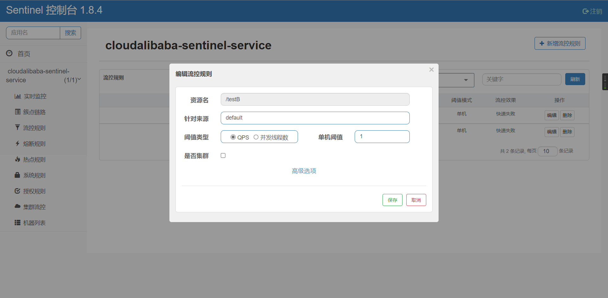
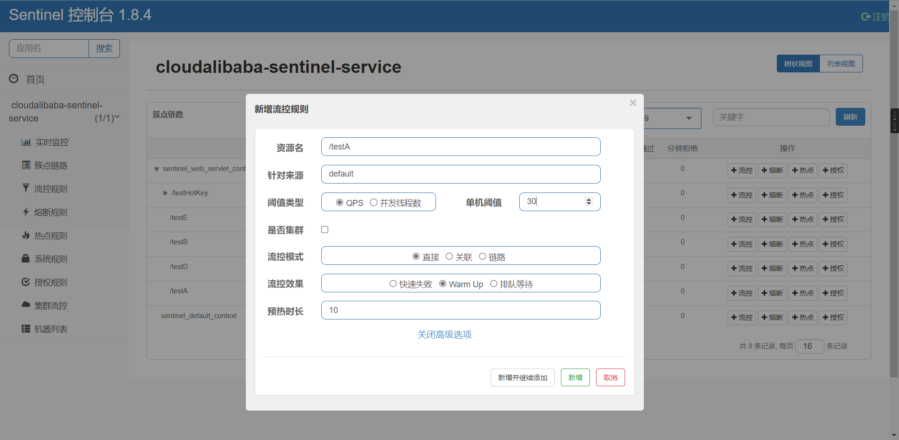
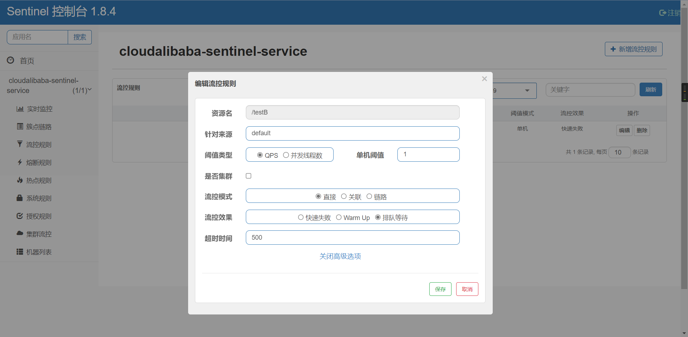
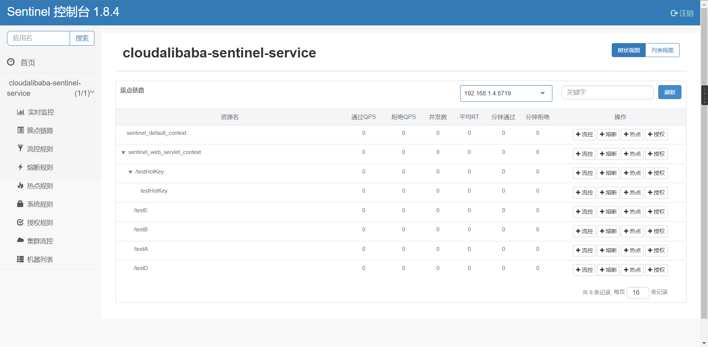
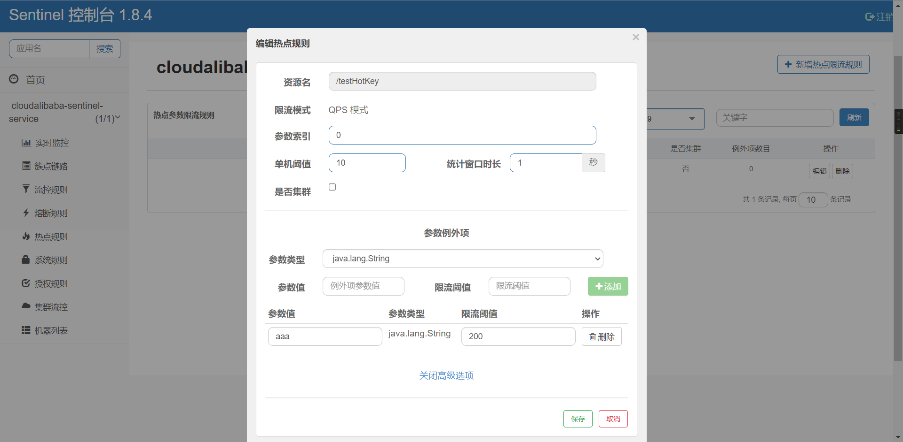
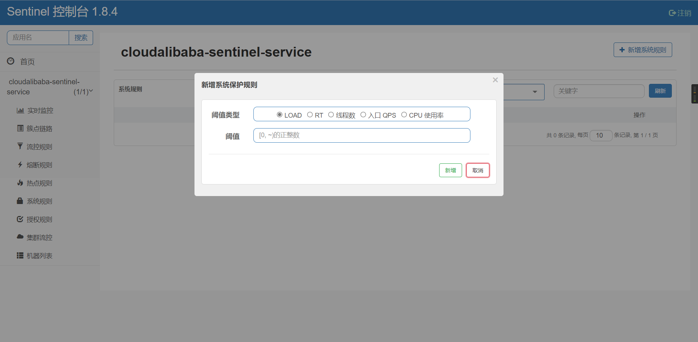
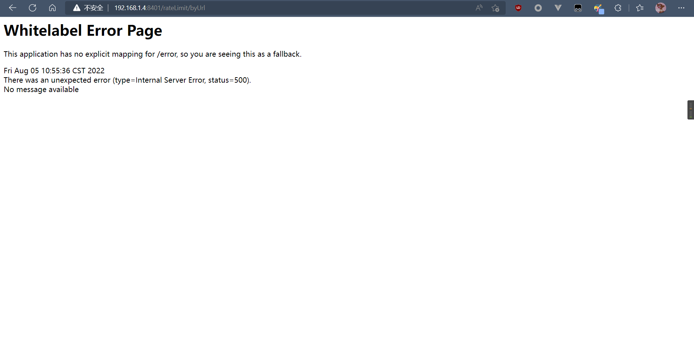
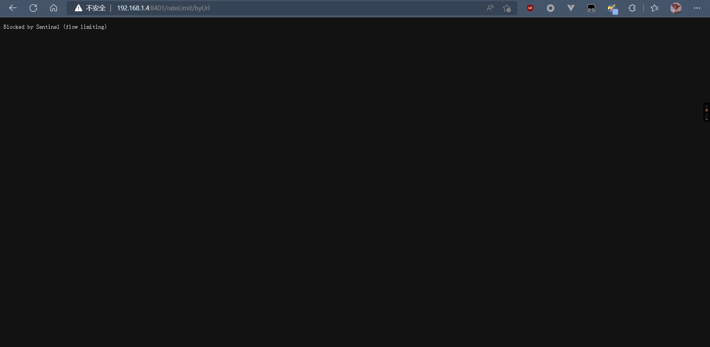
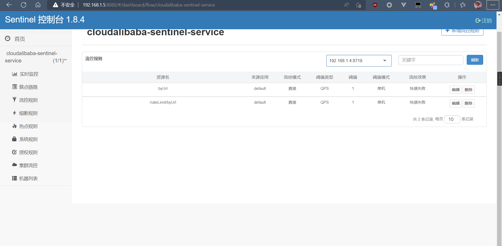

# SpringCloud


## 依赖管理

```xml
<?xml version="1.0" encoding="UTF-8"?>
<project xmlns="http://maven.apache.org/POM/4.0.0"
         xmlns:xsi="http://www.w3.org/2001/XMLSchema-instance"
         xsi:schemaLocation="http://maven.apache.org/POM/4.0.0 http://maven.apache.org/xsd/maven-4.0.0.xsd">
    <modelVersion>4.0.0</modelVersion>

    <groupId>org.example</groupId>
    <artifactId>spring-cloud-demo</artifactId>
    <version>1.0-SNAPSHOT</version>
    <packaging>pom</packaging>

    <modules>
        <module>cloud-eureka-server7001</module>
        <module>cloud-eureka-server-7002</module>
        <module>cloud-provider-payment8001</module>
        <module>cloud-provider-payment8002</module>
        <module>cloud-api-common</module>
        <module>cloud-consumer-order80</module>
    </modules>

    <properties>
        <maven.compiler.source>8</maven.compiler.source>
        <maven.compiler.target>8</maven.compiler.target>
    </properties>

    <dependencyManagement>
        <dependencies>
            <dependency>
                <groupId>org.springframework.boot</groupId>
                <artifactId>spring-boot-dependencies</artifactId>
                <version>2.2.2.RELEASE</version>
                <type>pom</type>
                <scope>import</scope>
            </dependency>

            <dependency>
                <groupId>org.springframework.cloud</groupId>
                <artifactId>spring-cloud-dependencies</artifactId>
                <version>Hoxton.SR1</version>
                <type>pom</type>
                <scope>import</scope>
            </dependency>
            <!--spring cloud alibaba 2.1.0.RELEASE-->
            <dependency>
                <groupId>com.alibaba.cloud</groupId>
                <artifactId>spring-cloud-alibaba-dependencies</artifactId>
                <version>2.1.0.RELEASE</version>
                <type>pom</type>
                <scope>import</scope>
            </dependency>

        </dependencies>
    </dependencyManagement>

    <build>
        <plugins>
            <plugin>
                <groupId>org.springframework.boot</groupId>
                <artifactId>spring-boot-maven-plugin</artifactId>
                <configuration>
                    <fork>true</fork>
                    <addResources>true</addResources>
                </configuration>
            </plugin>
        </plugins>
    </build>

</project>
```

Eureka服务注册中心依赖

```xml
    <dependencies>
        <dependency>
            <groupId>org.springframework.boot</groupId>
            <artifactId>spring-boot-starter-web</artifactId>
        </dependency>
        <dependency>
            <groupId>org.springframework.boot</groupId>
            <artifactId>spring-boot-test</artifactId>
            <scope>test</scope>
        </dependency>
        <dependency>
            <groupId>org.springframework.boot</groupId>
            <artifactId>spring-boot-starter-actuator</artifactId>
        </dependency>
        <dependency>
            <groupId>org.springframework.cloud</groupId>
            <artifactId>spring-cloud-starter-netflix-eureka-server</artifactId>
        </dependency>
    </dependencies>
```

Eureka客户服务依赖

```xml
    <dependencies>
        <dependency>
            <groupId>org.springframework.cloud</groupId>
            <artifactId>spring-cloud-starter-netflix-eureka-client</artifactId>
        </dependency>
        <dependency>
            <groupId>org.springframework.boot</groupId>
            <artifactId>spring-boot-starter-web</artifactId>
        </dependency>
        <dependency>
            <groupId>org.springframework.boot</groupId>
            <artifactId>spring-boot-starter-actuator</artifactId>
        </dependency>

        <dependency>
            <groupId>org.example</groupId>
            <artifactId>cloud-api-common</artifactId>
            <version>${project.version}</version>
        </dependency>
    </dependencies>
```

## 1、RestTemplate 服务调用

注册bean组件

```java
@Configuration
public class RestTemplateConfig {

    @Bean
    //@LoadBalanced //要使用Eureka的服务功能必须加上注解@LoadBelanced(服务轮询), 否则要调用具体的服务实例
    public RestTemplate restTemplate(RestTemplateBuilder restTemplateBuilder){
        return restTemplateBuilder.rootUri("localhost:8001").build();
    }
}
```

使用RestTemplate(服务消费者)

```java
package com.qibria.controller;

import com.cloud.vo.CommonResult;
import com.cloud.vo.Payment;
import org.springframework.beans.factory.annotation.Value;
import org.springframework.web.bind.annotation.GetMapping;
import org.springframework.web.bind.annotation.RestController;
import org.springframework.web.client.RestTemplate;

@RestController
public class HelloController {

    private final RestTemplate restTemplate;

    @Value("${server.port}")
    private String port;

    public HelloController(RestTemplate template) {
        this.restTemplate = template;
    }

    @GetMapping("hello")
    public CommonResult hello(){
        return restTemplate.getForObject("hello", CommonResult.class);
    }

    @GetMapping("hello/get")
    public CommonResult<Payment> helloGet(Payment payment){
        return restTemplate.getForObject("/hello/get?id={id}&serial={serial}",
                CommonResult.class, 10, "hello get");
    }

    @GetMapping("hello/post")
    public CommonResult<Payment> helloPost(Payment payment){
        return restTemplate.postForObject("/hello/post", payment, CommonResult.class);
    }

}
```

服务提供者

```java
@RestController
public class HelloController {

    @Value("${server.port}")
    private String port;

    @GetMapping("hello")
    public CommonResult hello(){
       return new CommonResult<>(200, "hello: " + port);
    }

    @GetMapping("hello/get")
    public CommonResult<Payment> helloGet(Payment payment){
       return new CommonResult<>(200, "hello get: " + port, payment);
    }

    @PostMapping("hello/post")
    public CommonResult<Payment> helloPost(@RequestBody Payment payment){
       return new CommonResult<>(200, "hello post: " + port, payment);
    }
}
```

## 2、Eureka服务注册中心使用

### 单注册中心实例

注册中心(单个注册中心实例)

```java
@EnableEurekaServer //代表此服务是注册中心
@SpringBootApplication
public class EurekaServer7001 {
    public static void main(String[] args) {
        SpringApplication.run(EurekaServer7001.class,args);
    }
}
```

```yaml
server:
  port: 7001

eureka:
  instance:
    hostname: localhost #eureka服务端的实例名称
  client:
    register-with-eureka: false     #false表示不向注册中心注册自己。
    fetch-registry: false     #false表示自己端就是注册中心，我的职责就是维护服务实例，并不需要去检索服务
    service-url:
      #集群指向其它eureka
      #defaultZone: http://127.0.0.1:7002/eureka/
      #单机就是7001自己
      defaultZone: http://${eureka.instance.hostname}:7001/eureka/
    #server:
    #关闭自我保护机制，保证不可用服务被及时踢除
      #enable-self-preservation: false
      #eviction-interval-timer-in-ms: 2000
```

注册应用实例(可以有多个相同实例，注意实例名不要相同)

```java
@SpringBootApplication
@EnableEurekaClient //代表注册客户服务实例
public class PaymentMain8001 {
    public static void main(String[] args) {
        SpringApplication.run(PaymentMain8001.class, args);
    }
}
```

```yaml
server:
  port: 8001

spring:
  application:
    name: cloud-payment-service

eureka:
  client:
    #表示是否将自己注册进EurekaServer默认为true。
    register-with-eureka: true
    #是否从EurekaServer抓取已有的注册信息，默认为true。单节点无所谓，集群必须设置为true才能配合ribbon使用负载均衡
    fetchRegistry: true
    service-url:
      #单机版
      defaultZone: http://127.0.0.1:7001/eureka
      # 集群版
      #defaultZone: http://eureka7001.com:7001/eureka,http://eureka7002.com:7002/eureka
  instance:
    instance-id: payment8001
    #访问路径可以显示IP地址
    prefer-ip-address: true
    #Eureka客户端向服务端发送心跳的时间间隔，单位为秒(默认是30秒)
    #lease-renewal-interval-in-seconds: 1
    #Eureka服务端在收到最后一次心跳后等待时间上限，单位为秒(默认是90秒)，超时将剔除服务
    #lease-expiration-duration-in-seconds: 2
```

### 多注册中心实例

```java
@EnableEurekaServer //代表此服务是注册中心
@SpringBootApplication
public class EurekaServer7001 {
    public static void main(String[] args) {
        SpringApplication.run(EurekaServer7001.class,args);
    }
}
```

```yaml
server:
  port: 7001

eureka:
  instance:
    hostname: eureka7001.com #eureka服务端的实例名称
  client:
    register-with-eureka: false     #false表示不向注册中心注册自己。
    fetch-registry: false     #false表示自己端就是注册中心，我的职责就是维护服务实例，并不需要去检索服务
    service-url:
      #集群指向其它eureka
      defaultZone: http://eureka7002.com:7002/eureka/
      #单机就是7001自己
      #defaultZone: http://${eureka.instance.hostname}:7001/eureka/
    #server:
    #关闭自我保护机制，保证不可用服务被及时踢除
      #enable-self-preservation: false
      #eviction-interval-timer-in-ms: 2000
```

```java
@EnableEurekaServer //代表此服务是注册中心
@SpringBootApplication
public class EurekaServer7002 {
    public static void main(String[] args) {
        SpringApplication.run(EurekaServer7001.class,args);
    }
}
```

```yaml
server:
  port: 7002

eureka:
  instance:
    hostname: eureka7002.com #eureka服务端的实例名称
  client:
    register-with-eureka: false     #false表示不向注册中心注册自己。
    fetch-registry: false     #false表示自己端就是注册中心，我的职责就是维护服务实例，并不需要去检索服务
    service-url:
      #集群指向其它eureka
      defaultZone: http://eureka7001.com:7001/eureka/
      #单机就是7001自己
      #defaultZone: http://${eureka.instance.hostname}:7001/eureka/
    #server:
    #关闭自我保护机制，保证不可用服务被及时踢除
      #enable-self-preservation: false
      #eviction-interval-timer-in-ms: 2000
```

注册服务实例(每个实例都都注册进注册中心)

```java
@SpringBootApplication
@EnableEurekaClient //代表注册客户服务实例
public class PaymentMain8001 {
    public static void main(String[] args) {
        SpringApplication.run(PaymentMain8001.class, args);
    }
}
```

```yaml
server:
  port: 8001

spring:
  application:
    name: cloud-payment-service

eureka:
  client:
    #表示是否将自己注册进EurekaServer默认为true。
    register-with-eureka: true
    #是否从EurekaServer抓取已有的注册信息，默认为true。单节点无所谓，集群必须设置为true才能配合ribbon使用负载均衡
    fetchRegistry: true
    service-url:
      #单机版
      #defaultZone: http://127.0.0.1:7001/eureka
      # 集群版
      #defaultZone: http://127.0.0.1:7001/eureka,http://127.0.0.1:7002/eureka
      defaultZone: http://eureka7001.com:7001/eureka,http://eureka7002.com:7002/eureka
  instance:
    instance-id: payment8001
    #访问路径可以显示IP地址
    prefer-ip-address: true
    #Eureka客户端向服务端发送心跳的时间间隔，单位为秒(默认是30秒)
    #lease-renewal-interval-in-seconds: 1
    #Eureka服务端在收到最后一次心跳后等待时间上限，单位为秒(默认是90秒)，超时将剔除服务
    #lease-expiration-duration-in-seconds: 2
```

服务消费者

```java
@EnableEurekaClient
@SpringBootApplication
public class OrderMain80 {
    public static void main(String[] args) {
        SpringApplication.run(OrderMain80.class,args);
    }
}
```

```yaml
server:
  port: 80

spring:
  application:
    name: cloud-order-sevice
#  zipkin:
#    base-url: http://localhost:9411
#  sleuth:
#    sampler:
#      probability: 1

eureka:
  client:
    #表示是否将自己注册进EurekaServer默认为true。
    register-with-eureka: true
    #是否从EurekaServer抓取已有的注册信息，默认为true。单节点无所谓，集群必须设置为true才能配合ribbon使用负载均衡
    fetchRegistry: true
    service-url:
      #单机
      #defaultZone: http://localhost:7001/eureka
      # 集群
      #defaultZone: http://127.0.0.1:7001/eureka,http://127.0.0.1:7002/eureka  # 集群版
      defaultZone: http://eureka7001.com:7001/eureka,http://eureka7002.com:7002/eureka
```

RestTemplate配置（重要）

```java
@Configuration
public class RestTemplateConfig {

    @Bean
    @LoadBalanced // 必须使用此注解否则服务中兴无法找到服务实例
    public RestTemplate restTemplate(RestTemplateBuilder restTemplateBuilder){
        return restTemplateBuilder.rootUri("http://CLOUD-PAYMENT-SERVICE").build(); 
        //CLOUD-PAYMENT-SERVICE服务实例名, 使用注册中心后不需要访问具体的主机名, 直接使用注册服务是定义的应用名即可
    }
}
```

RestTemplate使用(结合服务注册实例)

```java
@RestController
public class HelloController {

    private final RestTemplate restTemplate;

    @Value("${server.port}")
    private String port;

    public HelloController(RestTemplate template) {
        this.restTemplate = template;
    }

    @GetMapping("hello")
    public CommonResult hello(){
        return restTemplate.getForObject("hello", CommonResult.class);
    }

    @GetMapping("hello/get")
    public CommonResult<Payment> helloGet(Payment payment){
        return restTemplate.getForObject("/hello/get?id={id}&serial={serial}",
                CommonResult.class, 10, "hello get");
    }

    @GetMapping("hello/post")
    public CommonResult<Payment> helloPost(Payment payment){
        return restTemplate.postForObject("/hello/post", payment, CommonResult.class);
    }

}
```


### Discovery服务发现

客户服务主动获取注册中心的信息

主启动类使用注解 **@EnableDiscoveryClient**

```java
@EnableEurekaClient //客户服务注册
@EnableDiscoveryClient //服务发现
@SpringBootApplication
public class PaymentMain8001 {
    public static void main(String[] args) {
        SpringApplication.run(PaymentMain8001.class, args);
    }
}
```

```java
@RestController
public class HelloController {

    @GetMapping(value = "/payment/discovery")
    public Object discovery() {

        List<String> services = discoveryClient.getServices();
        for (String element : services) {
            log.info("*****element: "+element);
        }

        List<ServiceInstance> instances = discoveryClient.getInstances("CLOUD-PAYMENT-SERVICE");
        for (ServiceInstance instance : instances) {
            log.info(instance.getServiceId()+"\t"+
                     instance.getHost()+"\t"+instance.getPort()+"\t"+instance.getUri());
        }

        return this.discoveryClient;
    }

}
```

### Eureka自我保护

客户服务不可用时, Eureka不会立刻清理此服务实例, 根据其保护机制注册中心依然保存此实例，如果在阈值时间内无法收到服务心跳, 注册中心才会将服务实例从注册中心移除, 以此防止注册中心误删因为网络波动而无法发送心跳的服务器

怎么禁止自我保护

```yaml
server:
  port: 7001

eureka:
  instance:
    hostname: localhost #eureka服务端的实例名称
    instance-id: eureka7001
  client:
    register-with-eureka: false     #false表示不向注册中心注册自己。
    fetch-registry: false     #false表示自己端就是注册中心，我的职责就是维护服务实例，并不需要去检索服务
    service-url:
      #集群指向其它eureka
      defaultZone: http://127.0.0.1:7002/eureka/
      #单机就是7001自己
      #defaultZone: http://eureka7001.com:7001/eureka/
  server:
    enable-self-preservation: false # 关闭自我保护机制，保证不可用服务被及时踢除
    eviction-interval-timer-in-ms: 2000
```

```yaml
server:
  port: 8001

spring:
  application:
    name: cloud-payment-service

eureka:
  client:
    #表示是否将自己注册进EurekaServer默认为true。
    register-with-eureka: true
    #是否从EurekaServer抓取已有的注册信息，默认为true。单节点无所谓，集群必须设置为true才能配合ribbon使用负载均衡
    fetchRegistry: true
    service-url:
      #单机版
      #defaultZone: http://127.0.0.1:7001/eureka
      # 集群版
      defaultZone: http://127.0.0.1:7001/eureka,http://127.0.0.1:7002/eureka
      #defaultZone: http://eureka7001.com:7001/eureka,http://eureka7002.com:7002/eureka
  instance:
    instance-id: payment8001
    #访问路径可以显示IP地址
    prefer-ip-address: true
    #Eureka客户端向服务端发送心跳的时间间隔，单位为秒(默认是30秒)
    lease-renewal-interval-in-seconds: 1
    #Eureka服务端在收到最后一次心跳后等待时间上限，单位为秒(默认是90秒)，超时将剔除服务
    lease-expiration-duration-in-seconds: 2
```

## 3、Zookeeper注册中心

```xml
    <dependencies>
        <dependency>
            <groupId>org.springframework.boot</groupId>
            <artifactId>spring-boot-starter-web</artifactId>
        </dependency>

        <!-- SpringBoot整合zookeeper客户端 -->
        <dependency>
            <groupId>org.springframework.cloud</groupId>
            <artifactId>spring-cloud-starter-zookeeper-discovery</artifactId>
        </dependency>
    </dependencies>
```

```java
@SpringBootApplication
@EnableDiscoveryClient
public class ZkOrderMain80{
    public static void main(String[] args) {
        SpringApplication.run(ZkOrderMain80.class, args);
    }
}
```

```yaml
server:
  port: 80


#服务别名----注册zookeeper到注册中心名称
spring:
  application:
    name: cloud-consumer-order
  cloud:
    zookeeper:
      connect-string: 192.168.1.7:2181
```

```java
@Configuration
public class RestTemplateConfig {

    @Bean
    @LoadBalanced
    public RestTemplate restTemplate(RestTemplateBuilder restTemplateBuilder){
        return restTemplateBuilder.rootUri("http://cloud-provider-payment").build();
    }
}
```

```java
@RestController
public class HelloController {

    @Value("${server.port}")
    private String serverPort;

    @Resource
    private RestTemplate restTemplate;

    @RequestMapping(value = "/payment/zk")
    public String paymentZk() {
        return restTemplate.getForObject("/payment/zk",String.class);
    }
}
```

```java
@SpringBootApplication
@EnableDiscoveryClient
public class PaymentMain8004 {
    public static void main(String[] args) {
        SpringApplication.run(PaymentMain8004.class, args);
    }
}
```

```yaml
server:
  port: 8004


#服务别名----注册zookeeper到注册中心名称
spring:
  application:
    name: cloud-provider-payment
  cloud:
    zookeeper:
      connect-string: 192.168.1.7:2181
```

```java
@RestController
public class HelloController {

    @Value("${server.port}")
    private String serverPort;

    @RequestMapping(value = "/payment/zk")
    public String paymentZk() {
        return "springCloud with zookeeper: "+serverPort+"\t"+ UUID.randomUUID().toString();
    }
}
```

## 4、consul

启动命令

```shell
./consul agent -dev -ui -node=consul-dev -client=0.0.0.0
```

```xml
    <dependencies>
        <dependency>
            <groupId>org.springframework.cloud</groupId>
            <artifactId>spring-cloud-starter-consul-discovery</artifactId>
        </dependency>
        <!-- SpringBoot整合Web组件 -->
        <dependency>
            <groupId>org.springframework.boot</groupId>
            <artifactId>spring-boot-starter-web</artifactId>
        </dependency>
        <dependency>
            <groupId>org.springframework.boot</groupId>
            <artifactId>spring-boot-starter-actuator</artifactId>
        </dependency>
    </dependencies>
```

```java
@SpringBootApplication
@EnableDiscoveryClient
public class ConsulOrder80Main {
    public static void main(String[] args) {
        SpringApplication.run(ConsulOrder80Main.class, args);
    }
}
```

```yaml
server:
  port: 80

spring:
  application:
    name: cloud-consumer-order
  ####consul注册中心地址
  cloud:
    consul:
      host: 192.168.1.7
      port: 8500
      discovery:
        hostname: 127.0.0.1
        service-name: ${spring.application.name}
        heartbeat:
          enabled: true
```

```java
@Configuration
public class RestTemplateConfig {

    @Bean
    @LoadBalanced
    public RestTemplate restTemplate(RestTemplateBuilder restTemplateBuilder){
        return restTemplateBuilder.rootUri("http://consul-provider-payment").build();
    }
}
```

```java
@RestController
public class HelloController {

    @Resource
    private RestTemplate restTemplate;

    @RequestMapping(value = "/payment/consul")
    public String paymentZk() {
        return restTemplate.getForObject("/payment/consul",String.class);
    }
}
```

```java
@SpringBootApplication
@EnableDiscoveryClient
public class PaymentMain8006 {
    public static void main(String[] args) {
        SpringApplication.run(PaymentMain8006.class, args);
    }
}
```

```yaml
server:
  port: 8006

spring:
  application:
    name: consul-provider-payment
  ####consul注册中心地址
  cloud:
    consul:
      host: 192.168.1.7
      port: 8500
      discovery:
        hostname: 127.0.0.1
        service-name: ${spring.application.name}
        heartbeat:
          enabled: true
```

```java
@RestController
public class HelloController {

    @Value("${server.port}")
    private String port;

    @RequestMapping(value = "payment/consul")
    public String paymentConsul() {
        return "hello consul---" + port +"---"+ UUID.randomUUID();
    }
}
```

## 5、Riboon负载均衡

Eurake默认使用Riboon对RestTemplate做了负载均衡(轮询规则)

自定义负载均衡规则

> 注意: 此包不能和主启动类在同一个包路径下

```java
@Configuration
public class MySelfRule {
    @Bean
    public IRule myRule() {
        return new RandomRule();//定义为随机
    }
}
```

主启功类

```java
@EnableEurekaClient
@SpringBootApplication
@RibbonClient(name = "CLOUD-PAYMENT-SERVICE",configuration= MySelfRule.class)
public class OrderMain80 {
    public static void main(String[] args) {
        SpringApplication.run(OrderMain80.class,args);
    }
}
```

RestTemplate实例

```java
@Configuration
public class RestTemplateConfig {
    @Bean
    @LoadBalanced
    public RestTemplate restTemplate(RestTemplateBuilder restTemplateBuilder){
        return restTemplateBuilder.rootUri("http://CLOUD-PAYMENT-SERVICE").build();
    }
}
```

### 自定义实现负载均衡（轮询）

使用cps和回旋锁实现

顶层接口-只有一个方法(获取服务实例)

```java
public interface LoadBalancer{
    ServiceInstance instances(List<ServiceInstance> serviceInstances);
}
```

实现类

```java
@Component
public class MyLB implements LoadBalancer{

    private AtomicInteger atomicInteger = new AtomicInteger(0);

    public final int getAndIncrement(){
        int current;
        int next;
        do {
            current = this.atomicInteger.get();
            next = current >= 2147483647 ? 0 : current + 1;
        }while(!this.atomicInteger.compareAndSet(current,next));
        System.out.println("*****第几次访问，次数next: "+next);
        return next;
    }

    //负载均衡算法：rest接口第几次请求数 % 服务器集群总数量 = 实际调用服务器位置下标  ，每次服务重启动后rest接口计数从1开始。
    @Override
    public ServiceInstance instances(List<ServiceInstance> serviceInstances){
        int index = getAndIncrement() % serviceInstances.size();

        return serviceInstances.get(index);
    }
}
```

```java
@Configuration
public class RestTemplateConfig {
    @Bean
    //@LoadBalanced
    public RestTemplate restTemplate(RestTemplateBuilder restTemplateBuilder){
        return restTemplateBuilder.build();
    }
}
```

Controller

```java
@RestController
@Slf4j
public class OrderController{
    //public static final String PAYMENT_URL = "http://localhost:8001";

    public static final String PAYMENT_URL = "http://CLOUD-PAYMENT-SERVICE";

    @Resource
    private RestTemplate restTemplate;

    @Resource
    private LoadBalancer loadBalancer;

    @Resource
    private DiscoveryClient discoveryClient;

    @GetMapping(value = "/consumer/payment/lb")
    public String getPaymentLB()
    {
        List<ServiceInstance> instances = discoveryClient.getInstances("CLOUD-PAYMENT-SERVICE");

        if(instances == null || instances.size() <= 0)
        {
            return null;
        }

        ServiceInstance serviceInstance = loadBalancer.instances(instances);
        URI uri = serviceInstance.getUri();

        return restTemplate.getForObject(uri+"/payment/lb",String.class);

    }

}
```

## 6、Openfeign服务调用(面向消费者)

依赖

```xml
    <dependencies>
        <dependency>
            <groupId>org.springframework.cloud</groupId>
            <artifactId>spring-cloud-starter-openfeign</artifactId>
        </dependency>
        <!--eureka client-->
        <dependency>
            <groupId>org.springframework.cloud</groupId>
            <artifactId>spring-cloud-starter-netflix-eureka-client</artifactId>
        </dependency>
        <!-- 引入自己定义的api通用包，可以使用Payment支付Entity -->
        <dependency>
            <groupId>org.example</groupId>
            <artifactId>cloud-api-common</artifactId>
            <version>1.0-SNAPSHOT</version>
        </dependency>
        <!--web-->
        <dependency>
            <groupId>org.springframework.boot</groupId>
            <artifactId>spring-boot-starter-web</artifactId>
        </dependency>
        <dependency>
            <groupId>org.springframework.boot</groupId>
            <artifactId>spring-boot-starter-actuator</artifactId>
        </dependency>
    </dependencies>
```

```java
@SpringBootApplication
@EnableFeignClients
public class OrderFeignMain80 {
    public static void main(String[] args) {
        SpringApplication.run(OrderFeignMain80.class, args);
    }
}
```

```yaml
server:
  port: 80

spring:
  application:
    name: cloud-order-sevice

eureka:
  client:
    #表示是否将自己注册进EurekaServer默认为true。
    register-with-eureka: true
    #是否从EurekaServer抓取已有的注册信息，默认为true。单节点无所谓，集群必须设置为true才能配合ribbon使用负载均衡
    fetchRegistry: true
    service-url:
      #单机
      #defaultZone: http://localhost:7001/eureka
      # 集群
      defaultZone: http://127.0.0.1:7001/eureka,http://127.0.0.1:7002/eureka  # 集群版

#设置feign客户端超时时间(OpenFeign默认支持ribbon)
ribbon:
  #指的是建立连接所用的时间，适用于网络状况正常的情况下,两端连接所用的时间
  ReadTimeout: 5000
  #指的是建立连接后从服务器读取到可用资源所用的时间
  ConnectTimeout: 5000
```

```java
@Service
@FeignClient(value = "CLOUD-PAYMENT-SERVICE")
public interface PaymentFeignService {

    @GetMapping(value = "/hello")
    CommonResult<Payment> hello();

    @GetMapping(value = "/payment/feign/timeout")
    String paymentFeignTimeout();
}
```

```java
@RestController
public class HelloController {

    @Resource
    private PaymentFeignService paymentFeignService;

    @Value("${server.port}")
    private String port;

    @GetMapping("hello")
    public CommonResult<Payment> hello(){
        return paymentFeignService.hello();
    }
}
```

开启日志

```java
@Configuration
public class FeignConfig {
    @Bean
    Logger.Level feignLoggerLevel() {
        return Logger.Level.FULL;
    }
}
```

```yaml
server:
  port: 80

spring:
  application:
    name: cloud-order-sevice
#  zipkin:
#    base-url: http://localhost:9411
#  sleuth:
#    sampler:
#      probability: 1


eureka:
  client:
    #表示是否将自己注册进EurekaServer默认为true。
    register-with-eureka: true
    #是否从EurekaServer抓取已有的注册信息，默认为true。单节点无所谓，集群必须设置为true才能配合ribbon使用负载均衡
    fetchRegistry: true
    service-url:
      #单机
      #defaultZone: http://localhost:7001/eureka
      # 集群
      defaultZone: http://127.0.0.1:7001/eureka,http://127.0.0.1:7002/eureka  # 集群版

#设置feign客户端超时时间(OpenFeign默认支持ribbon)
ribbon:
  #指的是建立连接所用的时间，适用于网络状况正常的情况下,两端连接所用的时间
  ReadTimeout: 5000
  #指的是建立连接后从服务器读取到可用资源所用的时间
  ConnectTimeout: 5000

#开启feign日志
logging:
  level:
    com.qibria.cloud.service.PaymentFeignService: debug
```

## 7、Hystrix 服务熔断、降级、限流

```xml
    <dependencies>
        <!--openfeign-->
        <dependency>
            <groupId>org.springframework.cloud</groupId>
            <artifactId>spring-cloud-starter-openfeign</artifactId>
        </dependency>
        <!--hystrix-->
        <dependency>
            <groupId>org.springframework.cloud</groupId>
            <artifactId>spring-cloud-starter-netflix-hystrix</artifactId>
        </dependency>
        <!--eureka client-->
        <dependency>
            <groupId>org.springframework.cloud</groupId>
            <artifactId>spring-cloud-starter-netflix-eureka-client</artifactId>
        </dependency>
        <!-- 引入自己定义的api通用包，可以使用Payment支付Entity -->
        <dependency>
            <groupId>org.example</groupId>
            <artifactId>cloud-api-common</artifactId>
            <version>1.0-SNAPSHOT</version>
        </dependency>
        <!--web-->
        <dependency>
            <groupId>org.springframework.boot</groupId>
            <artifactId>spring-boot-starter-web</artifactId>
        </dependency>
        <dependency>
            <groupId>org.springframework.boot</groupId>
            <artifactId>spring-boot-starter-actuator</artifactId>
        </dependency>
    </dependencies>
```

### 服务降级

服务端降级

```java
@SpringBootApplication
@EnableEurekaClient
//@EnableHystrix 包含 @EnableCircuitBreaker
@EnableCircuitBreaker
public class PaymentHystrixMain8001 {
    public static void main(String[] args) {
        SpringApplication.run(PaymentHystrixMain8001.class, args);
    }
}
```

```yaml
server:
  port: 8001


spring:
  application:
    name: cloud-provider-hystrix-payment

eureka:
  client:
    #表示是否将自己注册进EurekaServer默认为true。
    register-with-eureka: true
    #是否从EurekaServer抓取已有的注册信息，默认为true。单节点无所谓，集群必须设置为true才能配合ribbon使用负载均衡
    fetchRegistry: true
    service-url:
      #单机版
      #defaultZone: http://127.0.0.1:7001/eureka
      # 集群版
      defaultZone: http://127.0.0.1:7001/eureka,http://127.0.0.1:7002/eureka
      #defaultZone: http://eureka7001.com:7001/eureka,http://eureka7002.com:7002/eureka
  instance:
    instance-id: hystrix_payment8001
    #访问路径可以显示IP地址
    prefer-ip-address: true
    #Eureka客户端向服务端发送心跳的时间间隔，单位为秒(默认是30秒)
    #lease-renewal-interval-in-seconds: 1
    #Eureka服务端在收到最后一次心跳后等待时间上限，单位为秒(默认是90秒)，超时将剔除服务
    #lease-expiration-duration-in-seconds: 2
```

```java
package com.qibria.cloud.service;

import com.netflix.hystrix.contrib.javanica.annotation.HystrixCommand;
import com.netflix.hystrix.contrib.javanica.annotation.HystrixProperty;
import org.springframework.stereotype.Service;

import java.util.concurrent.TimeUnit;

@Service
public class PaymentService {

    /**
     * 正常访问，肯定OK
     * @param id
     * @return
     */
    public String paymentInfo_OK(Integer id) {
        return "线程池:  "+Thread.currentThread().getName()+"  paymentInfo_OK,id:  "+id+"\t"+"O(∩_∩)O哈哈~";
    }


    @HystrixCommand(
            fallbackMethod = "paymentInfo_TimeOut_Handler",
            commandProperties = {
                @HystrixProperty(name="execution.isolation.thread.timeoutInMilliseconds",value="3000")})
    public String paymentInfo_TimeOut(Integer id) {

        //int age = 10/0;
        int timeNum = 5;
        try {
            TimeUnit.SECONDS.sleep(timeNum);
        } catch (InterruptedException e) {
            e.printStackTrace();
        }
        return "线程池:  "+Thread.currentThread().getName()+
            "  paymentInfo_TimeOut,id:  "+id+"\t"+"O(∩_∩)O哈哈~"+"\t耗时(秒):"+timeNum;
    }


    public String paymentInfo_TimeOut_Handler(Integer id){
        return "线程池:  "+Thread.currentThread().getName()+"  8001系统繁忙或者运行报错，请稍后再试,id:  "+id+"\t"+"o(╥﹏╥)o";
    }

}
```

```java
@RestController
public class PaymentController {

    private final Logger log = LoggerFactory.getLogger(PaymentController.class);

    @Resource
    private PaymentService paymentService;

    @Value("${server.port}")
    private String port;


    @GetMapping("/payment/hystrix/ok/{id}")
    public String paymentInfo_OK(@PathVariable("id") Integer id) {
        String result = paymentService.paymentInfo_OK(id);
        log.info("*****result: "+result);
        return result;
    }

    @GetMapping("/payment/hystrix/timeout/{id}")
    public String paymentInfo_TimeOut(@PathVariable("id") Integer id) {
        String result = paymentService.paymentInfo_TimeOut(id);
        log.info("*****result: "+result);
        return result;
    }

}
```

客户端降级

```java
@SpringBootApplication
@EnableFeignClients
@EnableHystrix //开启Hystrix
public class OrderHystrixMain80 {
    public static void main(String[] args) {
        SpringApplication.run(OrderHystrixMain80.class,args);
    }
}
```

```yaml
server:
  port: 80


spring:
  application:
    name: cloud-comsumer-hystrix-order

eureka:
  client:
    #表示是否将自己注册进EurekaServer默认为true。
    register-with-eureka: true
    #是否从EurekaServer抓取已有的注册信息，默认为true。单节点无所谓，集群必须设置为true才能配合ribbon使用负载均衡
    fetchRegistry: true
    service-url:
      #单机版
      #defaultZone: http://127.0.0.1:7001/eureka
      # 集群版
      defaultZone: http://127.0.0.1:7001/eureka,http://127.0.0.1:7002/eureka
      #defaultZone: http://eureka7001.com:7001/eureka,http://eureka7002.com:7002/eureka
  instance:
    instance-id: hystrix_order80
    #访问路径可以显示IP地址
    prefer-ip-address: true
    #Eureka客户端向服务端发送心跳的时间间隔，单位为秒(默认是30秒)
    #lease-renewal-interval-in-seconds: 1
    #Eureka服务端在收到最后一次心跳后等待时间上限，单位为秒(默认是90秒)，超时将剔除服务
    #lease-expiration-duration-in-seconds: 2
#设置feign客户端超时时间(OpenFeign默认支持ribbon)
ribbon:
  #指的是建立连接所用的时间，适用于网络状况正常的情况下,两端连接所用的时间
  ReadTimeout: 5000
  #指的是建立连接后从服务器读取到可用资源所用的时间
  ConnectTimeout: 5000

#开启hystrix服务
feign:
  hystrix:
    enabled: true
```

```java
@Component
//使用openfeign统一进行服务降级 PaymentFallbackService.class
@FeignClient(value = "CLOUD-PROVIDER-HYSTRIX-PAYMENT" ,fallback = PaymentFallbackService.class)
public interface PaymentHystrixService {

    @GetMapping("/payment/hystrix/ok/{id}")
    public String paymentInfo_OK(@PathVariable("id") Integer id);

    @GetMapping("/payment/hystrix/timeout/{id}")
    public String paymentInfo_TimeOut(@PathVariable("id") Integer id);

}
```

实现类

```java
@Component
public class PaymentFallbackService implements PaymentHystrixService {

    @Override
    public String paymentInfo_OK(Integer id) {
        return "-----PaymentFallbackService fall back-paymentInfo_OK ,o(╥﹏╥)o";
    }

    @Override
    public String paymentInfo_TimeOut(Integer id) {
        return "-----PaymentFallbackService fall back-paymentInfo_TimeOut ,o(╥﹏╥)o";
    }
}
```

```java
@RestController
@DefaultProperties(defaultFallback = "payment_Global_FallbackMethod") 
//全局服务降级, 如果下面没有设置 @HystrixCommand的commandProperties属性, 就会对持有@HystrixCommand的方法进行服务降级
public class OrderHystrixController {

    @Resource
    private PaymentHystrixService paymentHystrixService;

    @GetMapping("/consumer/payment/hystrix/ok/{id}")
    public String paymentInfo_OK(@PathVariable("id") Integer id){
        String result = paymentHystrixService.paymentInfo_OK(id);
        return result;
    }

   @GetMapping("/consumer/payment/hystrix/timeout/{id}")
//    @HystrixCommand(fallbackMethod = "paymentTimeOutFallbackMethod",commandProperties = {
//            @HystrixProperty(name="execution.isolation.thread.timeoutInMilliseconds",value="1500")
//    })
    @HystrixCommand
    public String paymentInfo_TimeOut(@PathVariable("id") Integer id) {
        //int age = 10/0;  //模拟错误发生, 引发服务降级
        String result = paymentHystrixService.paymentInfo_TimeOut(id);
        return result;
    }

    public String paymentTimeOutFallbackMethod(@PathVariable("id") Integer id) {
        return "我是消费者80,对方支付系统繁忙请10秒钟后再试或者自己运行出错请检查自己,o(╥﹏╥)o";
    }

    // 下面是全局fallback方法
    public String payment_Global_FallbackMethod() {
        return "Global异常处理信息，请稍后再试，/(ㄒoㄒ)/~~";
    }

}
```

### 服务熔断

```java
@Service
public class PaymentService {

    //=====服务熔断=============================
    @HystrixCommand(fallbackMethod = "paymentCircuitBreaker_fallback",commandProperties = {
            @HystrixProperty(name = "circuitBreaker.enabled",value = "true"),// 是否开启断路器
            @HystrixProperty(name = "circuitBreaker.requestVolumeThreshold",value = "10"),// 请求次数
            @HystrixProperty(name = "circuitBreaker.sleepWindowInMilliseconds",value = "10000"), // 时间窗口期
            @HystrixProperty(name = "circuitBreaker.errorThresholdPercentage",value = "60"),// 失败率达到多少后跳闸
    })
    public String paymentCircuitBreaker(@PathVariable("id") Integer id) {

        if(id < 0) {
            throw new RuntimeException("******id 不能负数");
        }
        String serialNumber = UUID.randomUUID().toString();

        return Thread.currentThread().getName()+"\t"+"调用成功，流水号: " + serialNumber;
    }

    public String paymentCircuitBreaker_fallback(@PathVariable("id") Integer id) {
        return "id 不能负数，请稍后再试，/(ㄒoㄒ)/~~   id: " +id;
    }

}
```

```java
    //====服务熔断
    @GetMapping("/payment/circuit/{id}")
    public String paymentCircuitBreaker(@PathVariable("id") Integer id)
    {
        String result = paymentService.paymentCircuitBreaker(id);
        log.info("****result: "+result);
        return result;
    }
```

### 服务面板

```xml
        <dependency>
            <groupId>org.springframework.cloud</groupId>
            <artifactId>spring-cloud-starter-netflix-hystrix-dashboard</artifactId>
        </dependency>
```

## 8、Gateway服务网关

```xml
    <dependencies>
        <!--gateway-->
        <dependency>
            <groupId>org.springframework.cloud</groupId>
            <artifactId>spring-cloud-starter-gateway</artifactId>
        </dependency>
        <!--eureka-client-->
        <dependency>
            <groupId>org.springframework.cloud</groupId>
            <artifactId>spring-cloud-starter-netflix-eureka-client</artifactId>
        </dependency>
        <!-- 引入自己定义的api通用包，可以使用Payment支付Entity -->
        <dependency>
            <groupId>org.example</groupId>
            <artifactId>cloud-api-common</artifactId>
            <version>1.0-SNAPSHOT</version>
        </dependency>
    </dependencies>
```

```java
@SpringBootApplication
public class GateWayMain9527 {

    public static void main(String[] args) {
        SpringApplication.run(GateWayMain9527.class, args);
    }
}
```

```yaml
server:
  port: 9527

spring:
  application:
    name: cloud-gateway
  cloud:
    gateway:
      discovery:
        locator:
          enabled: true
          #route-id-prefix: payment_provider
      routes:
        - id: payment_routh #payment_route    #路由的ID，没有固定规则但要求唯一，建议配合服务名
          #uri: http://localhost:8001          #匹配后提供服务的路由地址
          uri: lb://cloud-payment-service #匹配后提供服务的路由地址
          predicates:
            #- Path=/payment/get/**         # 断言，路径相匹配的进行路由
            - Path=/**         # 断言，路径相匹配的进行路由

        - id: payment_routh2 #payment_route    #路由的ID，没有固定规则但要求唯一，建议配合服务名
          #uri: http://localhost:8001          #匹配后提供服务的路由地址
          uri: lb://cloud-payment-service #匹配后提供服务的路由地址
          predicates:
            - Path=/payment/lb/**         # 断言，路径相匹配的进行路由
            #- After=2020-02-21T15:51:37.485+08:00[Asia/Shanghai]
            #- Cookie=username,zzyy
            #- Header=X-Request-Id, \d+  # 请求头要有X-Request-Id属性并且值为整数的正则表达式

eureka:
  instance:
    hostname: cloud-gateway-service
    instance-id: cloud-gateway-service9527
    prefer-ip-address: true
  client:
    register-with-eureka: true
    fetchRegistry: true
    service-url:
      defaultZone: http://127.0.0.1:7001/eureka,http://127.0.0.1:7002/eureka  # 集群版
```

上面用配置方式配置网关路由断言映射，也可以使用编码方式配置

```java
@Configuration
public class GateWayConfig{
    @Bean
    public RouteLocator customRouteLocator(RouteLocatorBuilder routeLocatorBuilder)    {
        RouteLocatorBuilder.Builder routes = routeLocatorBuilder.routes();

        routes.route("path_route_atguigu",
                r -> r.path("/guonei")
                        .uri("http://news.baidu.com/guonei")).build();

        return routes.build();
    }
}
```

### 网关过滤器

全局过滤器、独立过滤器、自定义过滤器

自定义过滤器

```java
package com.qibria.cloud.filter;

import com.cloud.vo.CommonResult;
import org.slf4j.Logger;
import org.slf4j.LoggerFactory;
import org.springframework.cloud.gateway.filter.GatewayFilterChain;
import org.springframework.cloud.gateway.filter.GlobalFilter;
import org.springframework.core.Ordered;
import org.springframework.core.io.buffer.DataBuffer;
import org.springframework.http.HttpStatus;
import org.springframework.http.server.reactive.ServerHttpResponse;
import org.springframework.stereotype.Component;
import org.springframework.util.MultiValueMap;
import org.springframework.web.server.ServerWebExchange;
import reactor.core.publisher.Mono;

import java.nio.charset.StandardCharsets;
import java.text.SimpleDateFormat;
import java.util.Date;

@Component
public class MyGateWayLogFilter implements GlobalFilter, Ordered {

    private final Logger logger = LoggerFactory.getLogger(MyGateWayLogFilter.class);

    @Override
    public Mono<Void> filter(ServerWebExchange exchange, GatewayFilterChain chain) {

        logger.info("--> start time: [{}]",new SimpleDateFormat("yyyy-MM-dd HH:mm:ss").format(new Date()));

        MultiValueMap<String, String> queryParams = exchange.getRequest().getQueryParams();
        queryParams.forEach((k, v) -> logger.info("key: {} || value: {}",k,v));

        String id = exchange.getRequest().getQueryParams().getFirst("id");
        if (id == null) {
            logger.error("请求参数id为空, 非法用户༼ つ ◕_◕ ༽つ");
            logger.info("<-- end time: [{}]",new SimpleDateFormat("yyyy-MM-dd HH:mm:ss").format(new Date()));
            //自定义返回封装对象
            CommonResult<String> data = new CommonResult<>(400,"请求参数id为空, 非法用户༼ つ ◕_◕ ༽つ",null);
            ServerHttpResponse response = exchange.getResponse();
            DataBuffer wrap = response.bufferFactory().wrap(data.toString().getBytes());
            response.setStatusCode(HttpStatus.BAD_GATEWAY);
            return response.writeWith(Mono.just(wrap));
        }
        logger.info("<-- end time: [{}]",new SimpleDateFormat("yyyy-MM-dd HH:mm:ss").format(new Date()));
        return chain.filter(exchange);
    }

    @Override
    public int getOrder() {
        return 0;
    }
}
```

## 9、Config配置中心

**ssh配置(已弃用)**

如果报如下错误 `reject HostKey: github.com`
原因：同一台电脑使用过两次公钥。
需要确认一下 `ssh -T git@github.com`。回车yes

如果报的错误是 `Auth fail`
原因：公钥不对。问题如果本地测试可以连接成功，springcloud连接失败，则是生成的问题。
原来的生成方式：`ssh-keygen -t rsa -C "yourname@your.com"`
改为：`ssh-keygen -m PEM -t rsa -b 4096 -C "yourname@your.com"`

**使用ed25515(github推荐使用的ssh连接方案，但是springcloud不支持)**

**使用ecdrsa(最终解决方案)**

> 如果都用不了的可是使用https连接方案

use ecdsa:

Get the hostKey

```bash
ssh-keyscan -t ecdsa github.com
# github.com:22 SSH-2.0-babeld-4f04c79d
github.com ecdsa-sha2-nistp256 AAAAE2VjZHNhLXNoYTItbmlzdHAyNTYAAAAIbmlzdHAyNTYAAABBBEmKSENjQEezOmxkZMy7opKgwFB9nkt5YRrYMjNuG5N87uRgg6CLrbo5wAdT/y6v0mKV0U2w0WZ2YB/++Tpockg=
```

Generate a new key

```css
ssh-keygen -t ecdsa -b 256 -m PEM
```

ssh配置文件

~/.ssh/config

```txt
# github
Host github.com
HostName github.com
PreferredAuthentications publickey
IdentityFile ~/.ssh/id_ecdsa
```

### 配置中心服务端配置

```xml
        <dependency>
            <groupId>org.springframework.cloud</groupId>
            <artifactId>spring-cloud-config-server</artifactId>
        </dependency>
        <dependency>
            <groupId>org.springframework.cloud</groupId>
            <artifactId>spring-cloud-starter-netflix-eureka-client</artifactId>
        </dependency>
        <dependency>
            <groupId>org.springframework.boot</groupId>
            <artifactId>spring-boot-starter-web</artifactId>
        </dependency>

        <dependency>
            <groupId>org.springframework.boot</groupId>
            <artifactId>spring-boot-starter-actuator</artifactId>
        </dependency>
```

启动类

```java
@SpringBootApplication
@EnableConfigServer
public class ConfigCenterMain3344 {

    public static void main(String[] args) {
        SpringApplication.run(ConfigCenterMain3344.class, args);
    }
}
```

配置文件

```yaml
server:
  port: 3344

spring:
  application:
    name: cloud-config-center
  cloud:
    config:
      server:
        git:
          uri: git@github.com:gerry-gqj/springcloud-config.git  #git仓库名字 git@github.com:zzyybs/springcloud-config.git
          search-paths:
            - springcloud-config # 配置文件路径
      label: master # 分支名

eureka:
  client:
    #表示是否将自己注册进EurekaServer默认为true。
    register-with-eureka: true
    #是否从EurekaServer抓取已有的注册信息，默认为true。单节点无所谓，集群必须设置为true才能配合ribbon使用负载均衡
    fetchRegistry: true
    service-url:
      #单机版
      #defaultZone: http://127.0.0.1:7001/eureka
      # 集群版
      defaultZone: http://127.0.0.1:7001/eureka,http://127.0.0.1:7002/eureka
      #defaultZone: http://eureka7001.com:7001/eureka,http://eureka7002.com:7002/eureka
  instance:
    instance-id: config-center3344
    #访问路径可以显示IP地址
    prefer-ip-address: true
    #Eureka客户端向服务端发送心跳的时间间隔，单位为秒(默认是30秒)
    #lease-renewal-interval-in-seconds: 1
    #Eureka服务端在收到最后一次心跳后等待时间上限，单位为秒(默认是90秒)，超时将剔除服务
    #lease-expiration-duration-in-seconds: 2
```

**服务端访问路径**

> ${hostname}:{server.port}/${branch}/${filename}

> 127.0.0.1:3344/master/config-dev.yaml

### 配置中心客户端配置

```xml
        <dependency>
            <groupId>org.springframework.cloud</groupId>
            <artifactId>spring-cloud-starter-config</artifactId>
        </dependency>
        <dependency>
            <groupId>org.springframework.cloud</groupId>
            <artifactId>spring-cloud-starter-netflix-eureka-client</artifactId>
        </dependency>
        <dependency>
            <groupId>org.springframework.boot</groupId>
            <artifactId>spring-boot-starter-web</artifactId>
        </dependency>
        <dependency>
            <groupId>org.springframework.boot</groupId>
            <artifactId>spring-boot-starter-actuator</artifactId>
        </dependency>
```

主启动类

```java
@EnableEurekaClient
@SpringBootApplication
public class ConfigClientMain3355 {

    public static void main(String[] args) {
        SpringApplication.run(ConfigClientMain3355.class, args);
    }
}
```

配置文件

boostrap.yaml

```yaml
server:
  port: 3355

spring:
  application:
    name: config-client
  cloud:
    #Config客户端配置
    config:
      label: master #分支名称
      name: config #配置文件名称
      profile: dev #读取后缀名称   上述3个综合：master分支上config-dev.yml的配置文件被读取http://config-3344.com:3344/master/config-dev.yml
      uri: http://127.0.0.1:3344 #配置中心地址k
eureka:
  client:
    service-url:
      defaultZone: http://127.0.0.1:7001/eureka,http://127.0.0.1:7002/eureka  # 集群版
  instance:
    prefer-ip-address: true
    instance-id: config-clent3355
```

controller

```java
@RestController
public class ConfigClientController {

    @Value("${config.info}")
    private String configInfo;

    @GetMapping("/info")
    public String configInfo(){
        return configInfo;
    }
}
```

访问路径

> 127.0.0.1:3355/info

### 配置文件动态仓库刷新（有缺陷）

依赖于actuator监控中心post请求刷新,  不能自动刷新

**客户端修改**

配置文件添加

```yaml
# 暴露监控端点
management:
  endpoints:
    web:
      exposure:
        include: "*"
```

@RefreshScope 注解在Controller上

```java
@RestController
@RefreshScope
public class ConfigClientController {

    @Value("${config.info}")
    private String configInfo;

    @GetMapping("/info")
    public String configInfo(){
        return configInfo;
    }
}
```

此时还不能自动刷新

通过actuator监控器实现手动刷新（可以不用重启服务器，可以说时另类的自动刷新手段，后续自动刷新工作由bus消息总线完成）

发送请求(post)

> POST http://127.0.0.1:3355/actuator/refresh

> GET http://127.0.0.1:3355/info

下一章使用消息总线解决定点刷新

## 10、Bus消息总线

配置中心服务端依赖

```xml
        <!--添加消息总线RabbitMQ支持-->
        <dependency>
            <groupId>org.springframework.cloud</groupId>
            <artifactId>spring-cloud-starter-bus-amqp</artifactId>
        </dependency>
        <dependency>
            <groupId>org.springframework.cloud</groupId>
            <artifactId>spring-cloud-config-server</artifactId>
        </dependency>
        <dependency>
            <groupId>org.springframework.cloud</groupId>
            <artifactId>spring-cloud-starter-netflix-eureka-client</artifactId>
        </dependency>
        <dependency>
            <groupId>org.springframework.boot</groupId>
            <artifactId>spring-boot-starter-web</artifactId>
        </dependency>

        <dependency>
            <groupId>org.springframework.boot</groupId>
            <artifactId>spring-boot-starter-actuator</artifactId>
        </dependency>
```

配置中心客户端依赖

```xml
         <!--添加消息总线RabbitMQ支持-->
        <dependency>
            <groupId>org.springframework.cloud</groupId>
            <artifactId>spring-cloud-starter-bus-amqp</artifactId>
        </dependency>
        <dependency>
            <groupId>org.springframework.cloud</groupId>
            <artifactId>spring-cloud-starter-config</artifactId>
        </dependency>
        <dependency>
            <groupId>org.springframework.cloud</groupId>
            <artifactId>spring-cloud-starter-netflix-eureka-client</artifactId>
        </dependency>
        <dependency>
            <groupId>org.springframework.boot</groupId>
            <artifactId>spring-boot-starter-web</artifactId>
        </dependency>
        <dependency>
            <groupId>org.springframework.boot</groupId>
            <artifactId>spring-boot-starter-actuator</artifactId>
        </dependency>
```

### 全局通知

**服务端配置**

```java
@SpringBootApplication
@EnableConfigServer
public class ConfigCenterMain3344{

    public static void main(String[] args) {
            SpringApplication.run(ConfigCenterMain3344.class, args);
    }
}
```

```yaml
server:
  port: 3344

spring:
  application:
    name: cloud-config-center
  cloud:
    config:
      server:
        git:
          uri: git@github.com:gerry-gqj/springcloud-config.git  #git仓库名字 git@github.com:zzyybs/springcloud-config.git
          search-paths:
            - springcloud-config # 配置文件路径
      label: master # 分支名
  rabbitmq:
    host: 192.168.1.7
    port: 5672
    password: 1
    username: rabboy

##rabbitmq相关配置,暴露bus刷新配置的端点
management:
  endpoints: #暴露bus刷新配置的端点
    web:
      exposure:
        include: 'bus-refresh'

eureka:
  client:
    #表示是否将自己注册进EurekaServer默认为true。
    register-with-eureka: true
    #是否从EurekaServer抓取已有的注册信息，默认为true。单节点无所谓，集群必须设置为true才能配合ribbon使用负载均衡
    fetchRegistry: true
    service-url:
      #单机版
      #defaultZone: http://127.0.0.1:7001/eureka
      # 集群版
      defaultZone: http://127.0.0.1:7001/eureka,http://127.0.0.1:7002/eureka
      #defaultZone: http://eureka7001.com:7001/eureka,http://eureka7002.com:7002/eureka
  instance:
    instance-id: config-center3344
    #访问路径可以显示IP地址
    prefer-ip-address: true
    #Eureka客户端向服务端发送心跳的时间间隔，单位为秒(默认是30秒)
    #lease-renewal-interval-in-seconds: 1
    #Eureka服务端在收到最后一次心跳后等待时间上限，单位为秒(默认是90秒)，超时将剔除服务
    #lease-expiration-duration-in-seconds: 2
```

客户端配置

```java
@EnableEurekaClient
@SpringBootApplication
public class ConfigClientMain3355 {

    public static void main(String[] args) {
        SpringApplication.run(ConfigClientMain3355.class, args);
    }
}
```

bootstrap.yaml

```yaml
# bootstrap.yaml

server:
  port: 3355

spring:
  application:
    name: config-client
  cloud:
    #Config客户端配置
    config:
      label: master #分支名称
      name: config #配置文件名称
      profile: dev #读取后缀名称   上述3个综合：master分支上config-dev.yml的配置文件被读取http://config-3344.com:3344/master/config-dev.yml
      uri: http://127.0.0.1:3344 #配置中心地址k
  rabbitmq:
    host: 192.168.1.7
    port: 5672
    username: rabboy
    password: 1
# 暴露监控端点
management:
  endpoints:
    web:
      exposure:
        include: "*"

eureka:
  client:
    service-url:
      defaultZone: http://127.0.0.1:7001/eureka,http://127.0.0.1:7002/eureka  # 集群版
  instance:
    prefer-ip-address: true
    instance-id: config-clent3355
```

```java
@RestController
@RefreshScope //用于动态刷新配置文件
public class ConfigClientController {

    @Value("${config.info}")
    private String configInfo;

    @GetMapping("/info")
    public String configInfo(){
        return configInfo;
    }
}
```

```java
@EnableEurekaClient
@SpringBootApplication
public class ConfigClientMain3366 {

    public static void main(String[] args) {
        SpringApplication.run(ConfigClientMain3366.class,args);
    }
}
```

bootstrap.yaml

```yaml
server:
  port: 3366

spring:
  application:
    name: config-client
  cloud:
    #Config客户端配置
    config:
      label: master #分支名称
      name: config #配置文件名称
      profile: dev #读取后缀名称   上述3个综合：master分支上config-dev.yml的配置文件被读取http://config-3344.com:3344/master/config-dev.yml
      uri: http://127.0.0.1:3344 #配置中心地址k
  rabbitmq:
    host: 192.168.1.7
    port: 5672
    username: rabboy
    password: 1
# 暴露监控端点
management:
  endpoints:
    web:
      exposure:
        include: "*"

eureka:
  client:
    service-url:
      defaultZone: http://127.0.0.1:7001/eureka,http://127.0.0.1:7002/eureka  # 集群版
  instance:
    prefer-ip-address: true
    instance-id: config-clent3366
```

```java
@RestController
@RefreshScope //用于动态刷新配置文件
public class ConfigClientController {

    @Value("${config.info}")
    private String configInfo;

    @Value("${server.port}")
    private String serverPort;

    @GetMapping("/info")
    public String configInfo(){
        return "config info:"+configInfo + "\tport: " + serverPort;
    }
}
```

```http
GET http://127.0.0.1:3355/info
```

```http
GET http://127.0.0.1:3366/info
```

服务端发送通知请求，刷新所有客户端配置

```shell
curl -X POST http://127.0.0.1:3344/actuator/bus-refresh
```

### 定点通知

服务端发送通知请求，刷新特定客户端配置

```shell
# curl -X POST http://127.0.0.1:3344/actuator/bus-refresh/${spring.application.name}:${server.port}
curl -X POST http://127.0.0.1:3344/actuator/bus-refresh/config-client:3355 # 只刷新3355服务
```

## 11、Stream消息驱动

消息驱动覆盖原有不同消息实现细节，对外暴露出同意的api调用

### 典型发布订阅模式搭建

#### 消息驱动服务提供者( 发布者)

```xml
        <dependency>
            <groupId>org.springframework.boot</groupId>
            <artifactId>spring-boot-starter-web</artifactId>
        </dependency>
        <dependency>
            <groupId>org.springframework.boot</groupId>
            <artifactId>spring-boot-starter-actuator</artifactId>
        </dependency>
        <dependency>
            <groupId>org.springframework.cloud</groupId>
            <artifactId>spring-cloud-starter-netflix-eureka-client</artifactId>
        </dependency>
        <dependency>
            <groupId>org.springframework.cloud</groupId>
            <artifactId>spring-cloud-starter-stream-rabbit</artifactId>
        </dependency>
```

```java
@SpringBootApplication
public class StreamMQMain8801 {

    public static void main(String[] args) {
        SpringApplication.run(StreamMQMain8801.class,args);
    }
}
```

```yaml
server:
  port: 8801

spring:
  application:
    name: cloud-stream-provider
  cloud:
    stream:
      binders: # 在此处配置要绑定的rabbitmq的服务信息；
        defaultRabbit: # 表示定义的名称，用于于binding整合
          type: rabbit # 消息组件类型
      bindings: # 服务的整合处理
        output: # 这个名字是一个通道的名称
          destination: studyExchange # 表示要使用的Exchange名称定义
          content-type: application/json # 设置消息类型，本次为json，文本则设置“text/plain”
          binder: defaultRabbit # 设置要绑定的消息服务的具体设置
  rabbitmq:
    host: 192.168.1.7
    port: 5672
    username: rabboy
    password: 1

eureka:
  client:
    register-with-eureka: true    #表示是否将自己注册进EurekaServer默认为true。
    fetchRegistry: true     #是否从EurekaServer抓取已有的注册信息，默认为true。单节点无所谓，集群必须设置为true才能配合ribbon使用负载均衡
    service-url:
      defaultZone: http://127.0.0.1:7001/eureka,http://127.0.0.1:7002/eureka #集群版
  instance:
    instance-id: send-8801   # 服务实例名
    prefer-ip-address: true     #访问路径可以显示IP地址
    lease-renewal-interval-in-seconds: 5     #Eureka客户端向服务端发送心跳的时间间隔，单位为秒(默认是30秒)
    lease-expiration-duration-in-seconds: 30 #Eureka服务端在收到最后一次心跳后等待时间上限，单位为秒(默认是90秒)，超时将剔除服务
```

```java
package com.qibria.cloud.service;

/**
 * 消息发送者
 */
public interface IMessageProvider {

    /**
     * 发送消息
     * @return str
     */
    String send();

}
```

```java
@EnableBinding(Source.class)
public class MessageProviderImpl implements IMessageProvider {

    private final Logger logger = LoggerFactory.getLogger(MessageProviderImpl.class);

    @Resource
    private MessageChannel output;

    @Override
    public String send() {
        String serial = UUID.randomUUID().toString();
        output.send(MessageBuilder.withPayload(serial).build());
        logger.info("-->serial:[{}] ",serial);
        return null;
    }
}
```

```java
@RestController
public class SendMessageController {

    @Resource
    private IMessageProvider messageProvider;

    @GetMapping("send")
    public String sendMessage(){
        return messageProvider.send();
    }
}
```

#### 消息驱动服务消费者（订阅者）

```xml
        <dependency>
            <groupId>org.springframework.boot</groupId>
            <artifactId>spring-boot-starter-web</artifactId>
        </dependency>
        <dependency>
            <groupId>org.springframework.cloud</groupId>
            <artifactId>spring-cloud-starter-netflix-eureka-client</artifactId>
        </dependency>
        <dependency>
            <groupId>org.springframework.cloud</groupId>
            <artifactId>spring-cloud-starter-stream-rabbit</artifactId>
        </dependency>
        <dependency>
            <groupId>org.springframework.boot</groupId>
            <artifactId>spring-boot-starter-actuator</artifactId>
        </dependency>
```

```java
@SpringBootApplication
public class StreamMQMain8802 {

    public static void main(String[] args) {
        SpringApplication.run(StreamMQMain8802.class,args);
    }
}
```

```yaml
server:
  port: 8802

spring:
  application:
    name: cloud-stream-consumer
  rabbitmq:
    host: 192.168.1.7
    port: 5672
    username: rabboy
    password: 1
  cloud:
    stream:
      binders: # 在此处配置要绑定的rabbitmq的服务信息；
        defaultRabbit: # 表示定义的名称，用于于binding整合
          type: rabbit # 消息组件类型
      bindings: # 服务的整合处理
        input: # 这个名字是一个通道的名称
          destination: studyExchange # 表示要使用的Exchange名称定义
          content-type: application/json # 设置消息类型，本次为对象json，如果是文本则设置“text/plain”
          binder: defaultRabbit # 设置要绑定的消息服务的具体设置

eureka:
  client:
    register-with-eureka: true  #表示是否将自己注册进EurekaServer默认为true。
    fetchRegistry: true         #是否从EurekaServer抓取已有的注册信息，默认为true。单节点无所谓，集群必须设置为true才能配合ribbon使用负载均衡
    service-url:
      defaultZone: http://127.0.0.1:7001/eureka,http://127.0.0.1:7002/eureka #集群版
  instance:
    instance-id: provider-8802
    prefer-ip-address: true     #访问路径可以显示IP地址
    lease-renewal-interval-in-seconds: 5     #Eureka客户端向服务端发送心跳的时间间隔，单位为秒(默认是30秒)
    lease-expiration-duration-in-seconds: 30 #Eureka服务端在收到最后一次心跳后等待时间上限，单位为秒(默认是90秒)，超时将剔除服务
```

```java
@Service
@EnableBinding({Sink.class})
public class ReceiveMessageListener {

    private final Logger logger = LoggerFactory.getLogger(ReceiveMessageListener.class);

    @Value("${server.port}")
    private String serverPort;

    @StreamListener(Sink.INPUT)
    public void input(Message<String> message){
        logger.info("server port:[{}]", serverPort);
        logger.info("message:[{}]", message);
        logger.info("消息内容 message payload: [{}]", message.getPayload());
    }
}
```

### stream消息重复消费和持久化问题

微服务默认将不同分组，只要完成消息订阅，一旦发布者发布消息，所有分组都会收到并且消费

如果微服务在不同分组中，全部服务都会去消费

在rabbitmq中，这就是典型exchange的fanout（扇出模式）

如果微服务是在相同分组中，那么只有一个服务去完成消费（类似于rabbitmq中的工作队列模式）

在rabbitmq中的队列(queue)对应stream中的分组(group)概念，在springcloud steam中相同分组的的消息指挥被一个服务器消费，不会出现所有服务器都消费同一个消息问题，在rabbitmq中就是说，有多个消费者都订阅了同一个消息队列queue，这时候当且只有一个消费者能收到队列中的消息（work queue---默认轮询方式，也可以手动设置消费方式）

完成分组只需要在配置文件设置一下分组属性就可以

```yaml
spring:
  application:
    name: cloud-stream-consumer
  cloud:
      stream:
        binders: # 在此处配置要绑定的rabbitmq的服务信息；
          defaultRabbit: # 表示定义的名称，用于于binding整合
            type: rabbit # 消息组件类型
            environment: # 设置rabbitmq的相关的环境配置
              spring:
                rabbitmq:
                  host: localhost
                  port: 5672
                  username: guest
                  password: guest
        bindings: # 服务的整合处理
          input: # 这个名字是一个通道的名称
            destination: studyExchange # 表示要使用的Exchange名称定义
            content-type: application/json # 设置消息类型，本次为对象json，如果是文本则设置“text/plain”
            binder: defaultRabbit # 设置要绑定的消息服务的具体设置
            group: group1111 #分组
```

消息持久化

## 12、zipkin与sleuth服务监控

在第二章的Eureka服务基础上进行扩展

添加依赖

```xml
        <!--包含了sleuth+zipkin-->
        <dependency>
            <groupId>org.springframework.cloud</groupId>
            <artifactId>spring-cloud-starter-zipkin</artifactId>
        </dependency>
```

Eurake注册中心7001，7002不需要修改

修改80（服务消费者---调用方），8001（服务提供者---被调用方）

配置文件修改

新增zipkin（注意zipkin是否启动9411）

```yaml
spring:
    zipkin:
      base-url: http://localhost:9411
    sleuth:
      sampler:
        probability: 1 # 采样率
```

添加controller---用于服务之间的请求调用

80---消费者端

```java
    // ====================> zipkin+sleuth
    @GetMapping("/consumer/payment/zipkin")
    public String paymentZipkin(){
        String result = restTemplate.getForObject("http://localhost:8001"+"/payment/zipkin/", String.class);
        return result;
    }
```

8001---提供者端

```java
    @GetMapping("/payment/zipkin")
    public String paymentZipkin(){
        return "hi ,i'am paymentzipkin server fall back，welcome to atguigu，O(∩_∩)O哈哈~";
    }
```

重复几次请求

```http
GET http://127.0.0.1/consumer/payment/zipkin
```

然后访问面板---查看请求之间的关系调用

```http
GEH http://127.0.0.1:9411/zipkin/
```

## 13、springcloudAlibaba nacos

安装与启动

window10下启动方式

在nacos/bin目录下启动

启动命令 --- 单价版启动方案（默认是集群版）

```shell
startup.cmd -m standalone
```

然后访问

```shell
GET localhost:8848/nanos/
```

账号密码都是nocas

### SpringCloudAlibaba与nacos集成

#### 服务提供者

依赖

> **pom.xml**

```xml
        <dependency>
            <groupId>org.example</groupId>
            <artifactId>cloud-api-common</artifactId>
            <version>1.0-SNAPSHOT</version>
        </dependency>
        <!--SpringCloud ailibaba nacos -->
        <dependency>
            <groupId>com.alibaba.cloud</groupId>
            <artifactId>spring-cloud-starter-alibaba-nacos-discovery</artifactId>
        </dependency>
        <!-- SpringBoot整合Web组件 -->
        <dependency>
            <groupId>org.springframework.boot</groupId>
            <artifactId>spring-boot-starter-web</artifactId>
        </dependency>
        <dependency>
            <groupId>org.springframework.boot</groupId>
            <artifactId>spring-boot-starter-actuator</artifactId>
        </dependency>
```

> **PaymentMain9001.java**

```java
@SpringBootApplication
@EnableDiscoveryClient
public class PaymentMain9001 {

    public static void main(String[] args) {
        SpringApplication.run(PaymentMain9001.class, args);
    }
}
```

> **application.yaml**

```yaml
server:
  port: 9001

spring:
  application:
    name: nacos-payment-provider
  cloud:
    nacos:
      discovery:
        server-addr: 192.168.1.7:8848 #配置Nacos地址

#端点暴露
management:
  endpoints:
    web:
      exposure:
        include: '*'
```

> **PaymentController.java**

```java
@RestController
public class PaymentController {

    @Value("${server.port}")
    private String serverPort;

    @GetMapping(value = "/payment/nacos/{id}")
    public CommonResult getPayment(@PathVariable("id") Integer id) {

        String message = "nacos registry, server port:" + serverPort + "\t-->id:" + id;
        CommonResult result = new CommonResult<>(200,message);
        return result;
    }
}
```

重复上面步骤新建一个一样的服务

```
启动类  PaymentMain9001.java
配置文件 application.yaml server.port:9002
```

#### 服务消费者

> **pom.xml**

```xml
        <!--SpringCloud ailibaba nacos -->
        <dependency>
            <groupId>org.example</groupId>
            <artifactId>cloud-api-common</artifactId>
            <version>1.0-SNAPSHOT</version>
        </dependency>
        <dependency>
            <groupId>com.alibaba.cloud</groupId>
            <artifactId>spring-cloud-starter-alibaba-nacos-discovery</artifactId>
        </dependency>
        <!-- SpringBoot整合Web组件 -->
        <dependency>
            <groupId>org.springframework.boot</groupId>
            <artifactId>spring-boot-starter-web</artifactId>
        </dependency>
        <dependency>
            <groupId>org.springframework.boot</groupId>
            <artifactId>spring-boot-starter-actuator</artifactId>
        </dependency>
```

> **主启动类 OrderNacosMain83.java**

```java
@EnableDiscoveryClient
@SpringBootApplication
public class OrderNacosMain83 {

    public static void main(String[] args) {
        SpringApplication.run(OrderNacosMain83.class,args);
    }
}
```

> **application.yaml**

```yaml
server:
  port: 83

spring:
  application:
    name: nacos-order-consumer
  cloud:
    nacos:
      discovery:
        server-addr: 192.168.1.7:8848


#消费者将要去访问的微服务名称(注册成功进nacos的微服务提供者)
restTemplate:
  service-url:
    nacos-user-service: http://nacos-payment-provider
```

> **RestTemplate.java**

```java
@Configuration
public class RestTemplateConfig {

    private final Logger logger = LoggerFactory.getLogger(RestTemplateConfig.class);

    @Value("${restTemplate.service-url.nacos-user-service}")
    private String nacosServer;

    @Bean
    @LoadBalanced
    public RestTemplate restTemplate(RestTemplateBuilder restTemplateBuilder){
        logger.info("nacosServer:[{}]", nacosServer);
        return restTemplateBuilder.rootUri(nacosServer).build();
    }
}
```

> **OrderNacosController.java**

```java
@RestController
public class OrderNacosController {

    @Resource
    private RestTemplate restTemplate;

    @GetMapping(value = "/consumer/payment/nacos/{id}")
    public String paymentInfo(@PathVariable("id") Long id) {

        return restTemplate.getForObject("/payment/nacos/"+id,String.class);
    }
}
```

## 14、springcloudalibaba nacos config

### 基本配置DataId

> **pom.xml**

```xml
        <!--nacos-config-->
        <dependency>
            <groupId>com.alibaba.cloud</groupId>
            <artifactId>spring-cloud-starter-alibaba-nacos-config</artifactId>
        </dependency>
        <!--nacos-discovery-->
        <dependency>
            <groupId>com.alibaba.cloud</groupId>
            <artifactId>spring-cloud-starter-alibaba-nacos-discovery</artifactId>
        </dependency>
        <!--web + actuator-->
        <dependency>
            <groupId>org.springframework.boot</groupId>
            <artifactId>spring-boot-starter-web</artifactId>
        </dependency>
        <dependency>
            <groupId>org.springframework.boot</groupId>
            <artifactId>spring-boot-starter-actuator</artifactId>
        </dependency>
```

> **NacosConfigClientMain3377.java**

```java
@SpringBootApplication
@EnableDiscoveryClient
public class NacosConfigClientMain3377 {

    public static void main(String[] args) {
        SpringApplication.run(NacosConfigClientMain3377.class, args);
    }
}
```

> **bootstrap.yaml**

```yaml
spring:
  cloud:
    nacos:
      discovery:
        server-addr: 192.168.1.7:8848 #Nacos服务注册中心地址
      config:
        server-addr: 192.168.1.7:8848 #Nacos作为配置中心地址
        file-extension: yaml #指定yaml格式的配置
        #group: DEFAULT_GROUP
        #namespace: ab2faf1fe8da9df7ed774d883fcf13c1

# ${spring.application.name}-${spring.profile.active}.${spring.cloud.nacos.config.file-extension}
# nacos-config-client-dev.yaml

# nacos-config-client-test.yaml   ----> config.info
```

> **application.yaml**

```yaml
spring:
  profiles:
    active: dev # 表示开发环境
    #active: test # 表示测试环境
    #active: info
```

> **application-dev.yaml**

```yaml
server:
  port: 3377

spring:
  application:
    name: nacos-config-client


#配置中心
#config:
#  info: |
#    nacos config center.
#    path = nacos-config-client-dev.yaml.
#    version = 1.
```

> **application-test.yaml**

```yaml
server:
  port: 3378

spring:
  application:
    name: nacos-config-client


#配置中心
#config:
#  info: |
#    nacos config center.
#    path = nacos-config-client-test.yaml.
#    version = 1.
```

配置中心 config副本

> nacos-config-client-dev.yaml

```yaml
config:
  info: |
    nacos config center.
    path = nacos-config-client-dev.yaml.
    version = 1.
```

> nacos-config-client-test.yaml

```yaml
config:
  info: |
    nacos config center.
    path = nacos-config-client-test.yaml.
    version = 1.
```

> **ConfigClientController.java**

```java
@RestController
//@RefreshScope(proxyMode = ScopedProxyMode.DEFAULT)//支持Nacos的动态刷新功能。
@RefreshScope//支持Nacos的动态刷新功能。
public class ConfigClientController {

    @Value("${config.info}")
    private String configInfo;

    @Value("${spring.profiles.active}")
    private String profiles;


    @GetMapping("/config/info")
    public String getConfigInfo() {
        return "profiles active: "+ profiles +
                "\n\rconfig info: "+ configInfo;
    }
}
```

```http
GET http://localhost:3378/config/info

GET http://localhost:3377/config/info
```

### 分组与命名空间

#### - 分组

配置文件修改

> **bootsrap.yaml**

```yaml
server:
  port: 3377
spring:
  application:
    name: nacos-config-client
  profiles:
    #active: dev # 表示开发环境
    #active: test # 表示测试环境
    active: info
  cloud:
    nacos:
      discovery:
        server-addr: 192.168.1.7:8848 #Nacos服务注册中心地址
      config:
        server-addr: 192.168.1.7:8848 #Nacos作为配置中心地址
        file-extension: yaml #指定yaml格式的配置
        group: DEV_GROUP 
        #group: TEST_GROUP
        #namespace: ab2faf1fe8da9df7ed774d883fcf13c1


# ${spring.application.name}-${spring.profile.active}.${spring.cloud.nacos.config.file-extension}
# nacos-config-client-dev.yaml

# nacos-config-client-test.yaml   ----> config.info
```

**配置中心 nacos config**

作用: 使用分组进行服务环境的隔离与切换

添加分组与配置文件

> Group: DEV_GROUP

> Data Id: nacos-config-client-info.yaml

```yaml
config:
  info: |
    nacos config center.
    group = DEV_GROUP.
    path = nacos-config-client-info.yaml.
    version = 1.
```

> Group: TEST_GROUP

> Data Id: nacos-config-client-info.yaml

```yaml
config:
  info: |
    nacos config center.
    group = TEST_GROUP.
    path = nacos-config-client-info.yaml.
    version = 1.
```

测试链接

```http
GET http://localhost:3377/config/info
```

#### - 命名空间

配置文件修改


```yaml

server:
  port: 3377
spring:
  application:
    name: nacos-config-client
  profiles:
    active: dev # 表示开发环境
    #active: test # 表示测试环境
    #active: info
  cloud:
    nacos:
      discovery:
        server-addr: 192.168.1.7:8848 #Nacos服务注册中心地址
      config:
        server-addr: 192.168.1.7:8848 #Nacos作为配置中心地址
        file-extension: yaml #指定yaml格式的配置
        group: DEFAULT_GROUP 
        #group: DEV_GROUP 
        #group: TEST_GROUP
        namespace: ab2faf1fe8da9df7ed774d883fcf13c1 # 命名空间

# ${spring.application.name}-${spring.profile.active}.${spring.cloud.nacos.config.file-extension}
# nacos-config-client-dev.yaml
# nacos-config-client-test.yaml   ----> config.info
```


**配置中心 nacos config**

新建命名空间dev、test

默认命名空间public

拿到 dev 的命名空间id: ab2faf1fe8da9df7ed774d883fcf13c1

添加分组与配置文件

> Group: DEFAULT_GROUP

> Data Id: nacos-config-client-info.yaml

```yaml
config:
  info: |
    nacos config center.
    namespace = ab2faf1fe8da9df7ed774d883fcf13c1
    group = DEFAULT_GROUP.
    path = nacos-config-client-info.yaml.
    version = 1.
```


### Nacos命名空间分组和DataID三者关系


**命名空间（Namespace）**
​ 用于进行租户粒度的配置隔离。不同的命名空间下，可以存在相同的 Group 或 Data ID 的配置。Namespace 的常用场景之一是不同环境的配置的区分隔离，例如开发测试环境和生产环境的资源（如配置、服务）隔离等。

**配置分组（Group）**
​ Nacos 中的一组配置集，是组织配置的维度之一。通过一个有意义的字符串（如 Buy 或 Trade ）对配置集进行分组，从而区分 Data ID 相同的配置集。当您在 Nacos 上创建一个配置时，如果未填写配置分组的名称，则配置分组的名称默认采用 DEFAULT_GROUP 。配置分组的常见场景：不同的应用或组件使用了相同的配置类型，如 database_url 配置和 MQ_topic 配置。
**配置集 ID（Data ID）**
​ Nacos 中的某个配置集的 ID。配置集 ID 是组织划分配置的维度之一。Data ID 通常用于组织划分系统的配置集。一个系统或者应用可以包含多个配置集，每个配置集都可以被一个有意义的名称标识。Data ID 通常采用类 Java 包（如 com.taobao.tc.refund.log.level）的命名规则保证全局唯一性。此命名规则非强制。
​ 配置集：一组相关或者不相关的配置项的集合称为配置集。在系统中，一个配置文件通常就是一个配置集，包含了系统各个方面的配置。例如，一个配置集可能包含了数据源、线程池、日志级别等配置项。
**三者关系**
​ 这三者的关系类似于Java里面的package名和类名，最外层的Namespace是可以用于区分部署环境的，Group和DataID逻辑上区分两个目标对象。

**默认情况**

Namespace=public，Group=DEFAULT_GROUP，默认Cluster是DEFAULT

**具体情况**

Nacos默认的命名空间是public，我们就可以利用Namespace来实现隔离，比如我们现在有三个环境：开发、测试、生产环境，我们就可以创建三个Namespace，不同的N amespace之间是隔离的。
​Group本身就是分组的意思，它可以把不同的微服务划分到同一个分组里面去。

剩下的就是具体微服务，一个Service可以包含多个Cluster，Nacos默认Cluster是DEFAULT，Cluster是对指定微服务的一个虚拟划分。比如说，将一个Service部署在北京和和杭州的机房中，北京机房的Service就可以起名为（BJ），杭州机房中的Service就可以起名为（HZ），这样就可以尽量让同一个机房的微服务互相调用，提升性能。


## 15、nacos 持久化与集群管理


### -持久化

> config/application.properties添加数据库支持
```properties
spring.datasource.platform=mysql

db.num=1
db.url.0=jdbc:mysql://192.168.1.5:3306/nacos_config?characterEncoding=utf8&connectTimeout=1000&socketTimeout=3000&autoReconnect=true&serverTimezone=Asia/Shanghai
db.user=root
db.password=root

```


### -集群配置

> config/cluster.config.example

```shell
cp cluster.config.example cluster.config
```

修改cluster.config

```shell
192.168.1.5:3333
192.168.1.5:4444
192.168.1.5:5555
```

修改启动文件
> bin/startup.sh

实现自定义端口参数启动
示例
```shell
./startup -p 3344
```

1.4之后版本p选项已经被使用，可以使用别的参数名d

> bin/startup.sh

```shell
#!/bin/bash


# Copyright 1999-2018 Alibaba Group Holding Ltd.

# Licensed under the Apache License, Version 2.0 (the "License");

# you may not use this file except in compliance with the License.

# You may obtain a copy of the License at


#      http://www.apache.org/licenses/LICENSE-2.0

#

# Unless required by applicable law or agreed to in writing, software

# distributed under the License is distributed on an "AS IS" BASIS,

# WITHOUT WARRANTIES OR CONDITIONS OF ANY KIND, either express or implied.

# See the License for the specific language governing permissions and

# limitations under the License.


cygwin=false

darwin=false

os400=false

case "`uname`" in

CYGWIN*) cygwin=true;;

Darwin*) darwin=true;;

OS400*) os400=true;;

esac

error_exit ()

{

    echo "ERROR: $1 !!"

    exit 1

}

[ ! -e "$JAVA_HOME/bin/java" ] && JAVA_HOME=$HOME/jdk/java

[ ! -e "$JAVA_HOME/bin/java" ] && JAVA_HOME=/usr/java

[ ! -e "$JAVA_HOME/bin/java" ] && JAVA_HOME=/opt/taobao/java

[ ! -e "$JAVA_HOME/bin/java" ] && unset JAVA_HOME


if [ -z "$JAVA_HOME" ]; then

  if $darwin; then


    if [ -x '/usr/libexec/java_home' ] ; then

      export JAVA_HOME=`/usr/libexec/java_home`


    elif [ -d "/System/Library/Frameworks/JavaVM.framework/Versions/CurrentJDK/Home" ]; then

      export JAVA_HOME="/System/Library/Frameworks/JavaVM.framework/Versions/CurrentJDK/Home"

    fi

  else

    JAVA_PATH=`dirname $(readlink -f $(which javac))`

    if [ "x$JAVA_PATH" != "x" ]; then

      export JAVA_HOME=`dirname $JAVA_PATH 2>/dev/null`

    fi

  fi

  if [ -z "$JAVA_HOME" ]; then

        error_exit "Please set the JAVA_HOME variable in your environment, We need java(x64)! jdk8 or later is better!"

  fi

fi


export SERVER="nacos-server"

export MODE="cluster"

export FUNCTION_MODE="all"

export MEMBER_LIST=""

export EMBEDDED_STORAGE=""

while getopts ":m:f:s:c:p:d:" opt

do

    case $opt in

        m)

            MODE=$OPTARG;;

        f)

            FUNCTION_MODE=$OPTARG;;

        s)

            SERVER=$OPTARG;;

        c)

            MEMBER_LIST=$OPTARG;;

        p)

            EMBEDDED_STORAGE=$OPTARG;;

	d)

	    PORT=$OPTARG;;

        ?)

        echo "Unknown parameter"

        exit 1;;

    esac

done


export JAVA_HOME

export JAVA="$JAVA_HOME/bin/java"

export BASE_DIR=`cd $(dirname $0)/..; pwd`

export CUSTOM_SEARCH_LOCATIONS=file:${BASE_DIR}/conf/


#===========================================================================================

# JVM Configuration

#===========================================================================================

if [[ "${MODE}" == "standalone" ]]; then

    JAVA_OPT="${JAVA_OPT} -Xms512m -Xmx512m -Xmn256m"

    JAVA_OPT="${JAVA_OPT} -Dnacos.standalone=true"

else

    if [[ "${EMBEDDED_STORAGE}" == "embedded" ]]; then

        JAVA_OPT="${JAVA_OPT} -DembeddedStorage=true"

    fi

    #JAVA_OPT="${JAVA_OPT} -server -Xms2g -Xmx2g -Xmn1g -XX:MetaspaceSize=128m -XX:MaxMetaspaceSize=320m"

    JAVA_OPT="${JAVA_OPT} -server -Xms512m -Xmx512m -Xmn1g -XX:MetaspaceSize=128m -XX:MaxMetaspaceSize=320m"

    JAVA_OPT="${JAVA_OPT} -XX:-OmitStackTraceInFastThrow -XX:+HeapDumpOnOutOfMemoryError -XX:HeapDumpPath=${BASE_DIR}/logs/java_heapdump.hprof"

    JAVA_OPT="${JAVA_OPT} -XX:-UseLargePages"


fi


if [[ "${FUNCTION_MODE}" == "config" ]]; then

    JAVA_OPT="${JAVA_OPT} -Dnacos.functionMode=config"

elif [[ "${FUNCTION_MODE}" == "naming" ]]; then

    JAVA_OPT="${JAVA_OPT} -Dnacos.functionMode=naming"

fi


JAVA_OPT="${JAVA_OPT} -Dnacos.member.list=${MEMBER_LIST}"


JAVA_MAJOR_VERSION=$($JAVA -version 2>&1 | sed -E -n 's/.* version "([0-9]*).*$/\1/p')

if [[ "$JAVA_MAJOR_VERSION" -ge "9" ]] ; then

  JAVA_OPT="${JAVA_OPT} -Xlog:gc*:file=${BASE_DIR}/logs/nacos_gc.log:time,tags:filecount=10,filesize=102400"

else

  JAVA_OPT_EXT_FIX="-Djava.ext.dirs=${JAVA_HOME}/jre/lib/ext:${JAVA_HOME}/lib/ext"

  JAVA_OPT="${JAVA_OPT} -Xloggc:${BASE_DIR}/logs/nacos_gc.log -verbose:gc -XX:+PrintGCDetails -XX:+PrintGCDateStamps -XX:+PrintGCTimeStamps -XX:+UseGCLogFileRotation -XX:NumberOfGCLogFiles=10 -XX:GCLogFileSize=100M"

fi


JAVA_OPT="${JAVA_OPT} -Dloader.path=${BASE_DIR}/plugins/health,${BASE_DIR}/plugins/cmdb,${BASE_DIR}/plugins/selector"

JAVA_OPT="${JAVA_OPT} -Dnacos.home=${BASE_DIR}"

JAVA_OPT="${JAVA_OPT} -jar ${BASE_DIR}/target/${SERVER}.jar"

JAVA_OPT="${JAVA_OPT} ${JAVA_OPT_EXT}"

JAVA_OPT="${JAVA_OPT} --spring.config.additional-location=${CUSTOM_SEARCH_LOCATIONS}"

JAVA_OPT="${JAVA_OPT} --logging.config=${BASE_DIR}/conf/nacos-logback.xml"

JAVA_OPT="${JAVA_OPT} --server.max-http-header-size=524288"


if [ ! -d "${BASE_DIR}/logs" ]; then

  mkdir ${BASE_DIR}/logs

fi


echo "$JAVA $JAVA_OPT_EXT_FIX ${JAVA_OPT}"


if [[ "${MODE}" == "standalone" ]]; then

    echo "nacos is starting with standalone"

else

    echo "nacos is starting with cluster"

fi


# check the start.out log output file

if [ ! -f "${BASE_DIR}/logs/start.out" ]; then

  touch "${BASE_DIR}/logs/start.out"

fi

# start

echo "$JAVA $JAVA_OPT_EXT_FIX ${JAVA_OPT}" > ${BASE_DIR}/logs/start.out 2>&1 &


if [[ "$JAVA_OPT_EXT_FIX" == "" ]]; then

  #nohup "$JAVA"  ${JAVA_OPT} nacos.nacos >> ${BASE_DIR}/logs/start.out 2>&1 &

  nohup "$JAVA" -Dserver.port=${PORT} ${JAVA_OPT} nacos.nacos >> ${BASE_DIR}/logs/start.out 2>&1 &

else

  #nohup "$JAVA"  "$JAVA_OPT_EXT_FIX" ${JAVA_OPT} nacos.nacos >> ${BASE_DIR}/logs/start.out 2>&1 &

  nohup "$JAVA" -Dserver.port=${PORT} "$JAVA_OPT_EXT_FIX" ${JAVA_OPT} nacos.nacos >> ${BASE_DIR}/logs/start.out 2>&1 &

fi


echo "nacos is starting，you can check the ${BASE_DIR}/logs/start.out"


```


修改的地方

1、添加选项d 指定端口启动服务

```shell
while getopts ":m:f:s:c:p:d:" opt

do

    case $opt in

        m)

            MODE=$OPTARG;;

        f)

            FUNCTION_MODE=$OPTARG;;

        s)

            SERVER=$OPTARG;;

        c)

            MEMBER_LIST=$OPTARG;;

        p)

            EMBEDDED_STORAGE=$OPTARG;;

	d)

	    PORT=$OPTARG;;

        ?)

        echo "Unknown parameter"

        exit 1;;

    esac

done
```

````sh
if [[ "$JAVA_OPT_EXT_FIX" == "" ]]; then

  #nohup "$JAVA"  ${JAVA_OPT} nacos.nacos >> ${BASE_DIR}/logs/start.out 2>&1 &

  nohup "$JAVA" -Dserver.port=${PORT} ${JAVA_OPT} nacos.nacos >> ${BASE_DIR}/logs/start.out 2>&1 &

else

  #nohup "$JAVA"  "$JAVA_OPT_EXT_FIX" ${JAVA_OPT} nacos.nacos >> ${BASE_DIR}/logs/start.out 2>&1 &

  nohup "$JAVA" -Dserver.port=${PORT} "$JAVA_OPT_EXT_FIX" ${JAVA_OPT} nacos.nacos >> ${BASE_DIR}/logs/start.out 2>&1 &

fi
````

2、 调节启动的虚拟机内存大小（可选）

```shell
    #JAVA_OPT="${JAVA_OPT} -server -Xms2g -Xmx2g -Xmn1g -XX:MetaspaceSize=128m -XX:MaxMetaspaceSize=320m"

    JAVA_OPT="${JAVA_OPT} -server -Xms512m -Xmx512m -Xmn1g -XX:MetaspaceSize=128m -XX:MaxMetaspaceSize=320m"
```


启动命令

```shell
./startup.sh -d 3333
./startup.sh -d 4444
./startup.sh -d 5555
```


nginx 配置(debian bullseye)

> /etc/nginx/site-enabled/naocs 软链接
>
> 真实文件在/etc/nginx/site-available

```sh
upstream nacos-cluster{
	server 127.0.0.1:3333;
	server 127.0.0.1:4444;
	server 127.0.0.1:5555;
}


server {
       listen 1111;
       listen [::]:1111;
      # server_name example.com;

       server_name localhost;
       #root /var/www/example.com;

       #index index.html;

       location / {
            proxy_pass http://nacos-cluster;
       }
#       location / {

#               try_files $uri $uri/ =404;

#       }

}

```


## 16、Sentinel


启动命令

```shell
java -Dserver.port=8080 -jar sentinel-dashboard-1.8.4.jar
```


访问链接

```http
GET 192.168.1.5:8080
```

> 用户名： sentinel	
>
> 密码： sentinel

启动nacos

> ./startup.sh -m standalone -d 8848


pom.xml

```xml
        <dependency>
            <groupId>org.example</groupId>
            <artifactId>cloud-api-common</artifactId>
            <version>1.0-SNAPSHOT</version>
        </dependency>
        <dependency>
            <groupId>com.alibaba.cloud</groupId>
            <artifactId>spring-cloud-starter-alibaba-nacos-discovery</artifactId>
        </dependency>
        <!--SpringCloud ailibaba sentinel-datasource-nacos 后续做持久化用到-->
        <dependency>
            <groupId>com.alibaba.csp</groupId>
            <artifactId>sentinel-datasource-nacos</artifactId>
        </dependency>
        <!--SpringCloud ailibaba sentinel -->
        <dependency>
            <groupId>com.alibaba.cloud</groupId>
            <artifactId>spring-cloud-starter-alibaba-sentinel</artifactId>
        </dependency>
        <!--openfeign-->
        <dependency>
            <groupId>org.springframework.cloud</groupId>
            <artifactId>spring-cloud-starter-openfeign</artifactId>
        </dependency>
        <!-- SpringBoot整合Web组件+actuator -->
        <dependency>
            <groupId>org.springframework.boot</groupId>
            <artifactId>spring-boot-starter-web</artifactId>
        </dependency>
        <dependency>
            <groupId>org.springframework.boot</groupId>
            <artifactId>spring-boot-starter-actuator</artifactId>
        </dependency>
```


主启动类MainApp8401.java

```java
@EnableDiscoveryClient
@SpringBootApplication
public class MainApp8401 {
    public static void main(String[] args) {
        SpringApplication.run(MainApp8401.class,args);
    }
}
```


application.yaml

```properties
server:
  port: 8401

spring:
  application:
    name: cloudalibaba-sentinel-service
  cloud:
    nacos:
      discovery:
        server-addr: 192.168.1.5:8848 #Nacos服务注册中心地址
    sentinel:
      transport:
        dashboard: 192.168.1.5:8080 #配置Sentinel dashboard地址
        port: 8719 #sentinel 会启动一个服务与dashboard面板通信，如果端口被占用会自动+1知道找到没有被占用端口，默认就是8719
        client-ip: 192.168.1.4 # 本机ip
#      datasource:
#        ds1:
#          nacos:
#            server-addr: localhost:8848
#            dataId: cloudalibaba-sentinel-services
#            groupId: DEFAULT_GROUP
#            data-type: json
#            rule-type: flow

management:
  endpoints:
    web:
      exposure:
        include: '*'

feign:
  sentinel:
    enabled: true # 激活Sentinel对Feign的支持

```


FlowLimitController.java

```java
@RestController
public class FlowLimitController {

    private final Logger log = LoggerFactory.getLogger(FlowLimitController.class);

    @GetMapping("/testA")
    public String testA() {
        try {
            TimeUnit.MILLISECONDS.sleep(800);
        } catch (InterruptedException e) {
            e.printStackTrace();
        }
        return "------testA";
    }

    @GetMapping("/testB")
    public String testB() {
        log.info(Thread.currentThread().getName()+"\t"+"...testB");
        return "------testB";
    }


    @GetMapping("/testD")
    public String testD() {
        try { TimeUnit.SECONDS.sleep(1); } catch (InterruptedException e) { e.printStackTrace(); }
        log.info("testD 测试RT");

        log.info("testD 异常比例");
        //int age = 10/0;
        return "------testD";
    }

    @GetMapping("/testE")
    public String testE() {
        log.info("testE 测试异常数");
        int age = 10/0;
        return "------testE 测试异常数";
    }

    @GetMapping("/testHotKey")
    @SentinelResource(value = "testHotKey",blockHandler = "deal_testHotKey")
    public String testHotKey(@RequestParam(value = "p1",required = false) String p1,
                             @RequestParam(value = "p2",required = false) String p2) {
        //int age = 10/0;
        return "------testHotKey";
    }
    public String deal_testHotKey (String p1, String p2, BlockException exception) {
        log.info("p1:{} ||| p2:{}",p1,p2);
        return "p1:"+p1+"||p2:"+p2+"------deal_testHotKey,o(╥﹏╥)o";  //sentinel系统默认的提示：Blocked by Sentinel (flow limiting)
    }

```


### 流控规则（sentinel面板配置）

簇点链路


添加规则

QPS--每秒请求数

并发线程数



高级选项

**关联**

/testB 每秒请求（QPS）超过1 会导致 /testA 失败


**链路**

A-->B的请求失败不会导致C-->B的请求失败


### 流控效果

快速失败、warm up、排队等待


**快速失败**


**warm up**

当流量突然增大的时候，我们常常会希望系统从空闲状态到繁忙状态的切换的时间长一些。即如果系统在此之前长期处于空闲的状态，我们希望处理请求的数量是缓步的增多，经过预期的时间以后，到达系统处理请求个数的最大值。Warm Up（冷启动，预热）模式就是为了实现这个目的的。

这个场景主要用于启动需要额外开销的场景，例如建立数据库连接等。

它的实现是在 [Guava](https://github.com/google/guava/blob/master/guava/src/com/google/common/util/concurrent/SmoothRateLimiter.java) 的算法的基础上实现的。然而，和 Guava 的场景不同，Guava 的场景主要用于调节请求的间隔，即 [Leaky Bucket](https://en.wikipedia.org/wiki/Leaky_bucket)，而 Sentinel 则主要用于控制每秒的 QPS，即我们满足每秒通过的 QPS 即可，我们不需要关注每个请求的间隔，换言之，我们更像一个 [Token Bucket](https://en.wikipedia.org/wiki/Token_bucket)。

我们用桶里剩余的令牌来量化系统的使用率。假设系统每秒的处理能力为 b,系统每处理一个请求，就从桶中取走一个令牌；每秒这个令牌桶会自动掉落b个令牌。令牌桶越满，则说明系统的利用率越低；当令牌桶里的令牌高于某个阈值之后，我们称之为令牌桶"饱和"。

当令牌桶饱和的时候，基于 Guava 的计算上，我们可以推出下面两个公式:

```
rate(c)=m*c+ coldrate
```

其中，rate 为当前请求和上一个请求的间隔时间，而 rate 是和令牌桶中的高于阈值的令牌数量成线形关系的。cold rate 则为当桶满的时候，请求和请求的最大间隔。通常是 `coldFactor * rate(stable)`。

通常冷启动的过程系统允许通过的 QPS 曲线如下图所示：


默认 `coldFactor` 为 3，即请求 QPS 从 `threshold / 3` 开始，经预热时长逐渐升至设定的 QPS 阈值。



开始预热值30/3=10

在10秒之后上升到30


**排队等待**




### 服务降级/熔断




#### 慢调用比例

RT 最大的响应时间

比例阈值 0-1

熔断时长


#### 异常比例


#### 异常数


### 热点key

对请求的某一个参数进行监控限制

@HystrixCommand 到 @SentinelResource

```java
	@GetMapping("/testHotKey")
    @SentinelResource(value = "testHotKey",blockHandler = "deal_testHotKey")
    public String testHotKey(@RequestParam(value = "p1",required = false) String p1,
                             @RequestParam(value = "p2",required = false) String p2) {
        //int age = 10/0;
        return "------testHotKey";
    }
    public String deal_testHotKey (String p1, String p2, BlockException exception) {
        log.info("p1:{} ||| p2:{}",p1,p2);
        return "p1:"+p1+"||p2:"+p2+"------deal_testHotKey,o(╥﹏╥)o";  //sentinel系统默认的提示：Blocked by Sentinel (flow limiting)
    }

```


**@SentinelResource(value = "testHotKey",blockHandler = "deal_testHotKey")**

自定义降级方法

**value = "testHotKey"**

可以在控制面板对testHotKey进行监控

**也可以不设降级规则，但是系统会返回500错误**

```java
	@GetMapping("/testHotKey")
    @SentinelResource(value = "testHotKey")
    public String testHotKey(@RequestParam(value = "p1",required = false) String p1,
                             @RequestParam(value = "p2",required = false) String p2) {
        //int age = 10/0;
        return "------testHotKey";
    }
```


**重点: @SentinelResource只处理控制台的规则，服务器内部的异常不会处理**

例如: 手动制造异常 int 1 =10/0;

系统还是会报500异常，控制台不会管系统内部的异常，后续有fallback处理


添加热点key规则



参数索引: 0 代表p1参数

参数例外项: 例如p1 = aaa时 允许200 的QPS 

可以添加多个选项


### 系统规则




- **Load 自适应（仅对 Linux/Unix-like 机器生效）**：系统的 load1 作为启发指标，进行自适应系统保护。当系统 load1 超过设定的启发值，且系统当前的并发线程数超过估算的系统容量时才会触发系统保护（BBR 阶段）。系统容量由系统的 maxQps * minRt 估算得出。设定参考值一般是 CPU cores * 2.5。
- **平均 RT**：当单台机器上所有入口流量的平均 RT 达到阈值即触发系统保护，单位是毫秒。
- **并发线程数**：当单台机器上所有入口流量的并发线程数达到阈值即触发系统保护。
- **入口 QPS**：当单台机器上所有入口流量的 QPS 达到阈值即触发系统保护。
- **CPU usage（1.5.0+ 版本**）：当系统 CPU 使用率超过阈值即触发系统保护（取值范围 0.0-1.0），比较灵敏。


### @SentinelResource使用

RateLimitController.java

```java
@RestController
public class RateLimitController {
    @GetMapping("/byResource")
    @SentinelResource(value = "byResource",blockHandler = "handleException")
    public CommonResult byResource() {
        return new CommonResult(200,"按资源名称限流测试OK",new Payment(2020L,"serial001"));
    }

    public CommonResult handleException(BlockException exception) {
        return new CommonResult(444,exception.getClass().getCanonicalName()+"\t 服务不可用");
    }

    @GetMapping("/rateLimit/byUrl")
    @SentinelResource(value = "byUrl")
    public CommonResult byUrl() {
        return new CommonResult(200,"按url限流测试OK",new Payment(2020L,"serial002"));
    }


    @GetMapping("/rateLimit/customerBlockHandler")
    @SentinelResource(value = "customerBlockHandler",
            blockHandlerClass = CustomerBlockHandler.class,
            blockHandler = "handlerException2")
    public CommonResult customerBlockHandler() {
        return new CommonResult(200,"按客戶自定义",new Payment(2020L,"serial003"));
    }
}

```


CustomerBlockHandler.java

```java
public class CustomerBlockHandler {

    public static CommonResult handlerException(BlockException exception) {
        return new CommonResult(4444,"按客戶自定义,global handlerException----1");
    }

    public static CommonResult handlerException2(BlockException exception) {
        return new CommonResult(4444,"按客戶自定义,global handlerException----2");
    }
}

```


@SentinelResource(value = "byResource",blockHandler = "handleException")

byResource就是资源名

/byResource是url

通过访问URL限流会返回sentinel自带默认的限流处理信息


使用资源名是如果没有设置blockHandle，系统限流会返回500




按照URL名配置会




同时配了URL和资源名，URL优先级高




设置了blockHandler，会按照 @SentinelResource(value = "byResource",blockHandler = "handleException") 的handleException方法执行

```java
    public CommonResult handleException(BlockException exception) {
        return new CommonResult(444,exception.getClass().getCanonicalName()+"\t 服务不可用");
    }
```


结论: 

按照URL配置规则，一切都使用Sentinel默认自带的配置

使用资源名 配置规则时，如果没有配置blockHandler 的方法，系统会报500错误，例如@SentinelResource(value = "byResource")，在控制台配置了byResource规则，超过请求阈值会直接报500错误；

配置了blockHandler 选项时@SentinelResource(value = "byResource",blockHandler = "handleException") ，并且类中有handleException方法时，超过请求阈值时系统会执行handleException方法返回限流规则结果而不是返回500错误提示，如果同时设置了URL和资源名规则，URL规则优先级最高


#### 自定义限流规则


自定义限流类

CustomerBlockHandler.java

```java
public class CustomerBlockHandler {

    public static CommonResult handlerException(BlockException exception) {
        return new CommonResult(4444,"按客戶自定义,global handlerException----1");
    }

    public static CommonResult handlerException2(BlockException exception) {
        return new CommonResult(4444,"按客戶自定义,global handlerException----2");
    }
}
```


Controller

```java
    @GetMapping("/rateLimit/customerBlockHandler")
    @SentinelResource(value = "customerBlockHandler",
            blockHandlerClass = CustomerBlockHandler.class,
            blockHandler = "handlerException2")
    public CommonResult customerBlockHandler() {
        return new CommonResult(200,"按客戶自定义",new Payment(2020L,"serial003"));
    }
```


注意: 

CustomerBlockHandler.java中的方法时静态方法

@SentinelResource 不要方法private修饰的方法上面，使用时注意使用blockHandler和fallback，value不能为空，defaultFallback选线的方法必须在本类中，同时配置fallback和defaultFallback时只会有fallback生效，fallbackClass 的类方法必需是静态方法，exceptionToIgnore忽略某些异常


### Sentinel结合Ribbon负载均衡OpenFeign

#### 服务搭建

##### 服务提供者

cloudalibaba-provider-payment9003

cloudalibaba-provider-payment9004

下面搭建9003 ，9004 复制改启动类和端口号即可

pom.xml

```xml
        <dependency>
            <groupId>org.example</groupId>
            <artifactId>cloud-api-common</artifactId>
            <version>1.0-SNAPSHOT</version>
        </dependency>
        <!--SpringCloud ailibaba nacos -->
        <dependency>
            <groupId>com.alibaba.cloud</groupId>
            <artifactId>spring-cloud-starter-alibaba-nacos-discovery</artifactId>
        </dependency>
        <!-- SpringBoot整合Web组件 -->
        <dependency>
            <groupId>org.springframework.boot</groupId>
            <artifactId>spring-boot-starter-web</artifactId>
        </dependency>
        <dependency>
            <groupId>org.springframework.boot</groupId>
            <artifactId>spring-boot-starter-actuator</artifactId>
        </dependency>
```


```java
@SpringBootApplication
@EnableDiscoveryClient
public class PaymentMain9003 {

    public static void main(String[] args) {
        SpringApplication.run(PaymentMain9003.class, args);
    }
}
```


```yaml
server:
  port: 9003

spring:
  application:
    name: nacos-payment-provider
  cloud:
    nacos:
      discovery:
        #server-addr: 192.168.1.5:1111 #nginx代理nacos地址
        server-addr: 192.168.1.5:8848 #配置Nacos地址

management:
  endpoints:
    web:
      exposure:
        include: '*'

```


```java
@RestController
public class PaymentController {

    @Value("${server.port}")
    private String serverPort;

    public static HashMap<Long,Payment> hashMap = new HashMap<>();

    static {
        hashMap.put(1L,new Payment(1L,"28a8c1e3bc2742d8848569891fb42181"));
        hashMap.put(2L,new Payment(2L,"bba8c1e3bc2742d8848569891ac32182"));
        hashMap.put(3L,new Payment(3L,"6ua8c1e3bc2742d8848569891xt92183"));
    }

    @GetMapping(value = "/paymentSQL/{id}")
    public CommonResult<Payment> paymentSQL(@PathVariable("id") Long id) {
        Payment payment = hashMap.get(id);
        CommonResult<Payment> result = new CommonResult(200,"from mysql,serverPort:  "+serverPort,payment);
        return result;
    }
}
```


##### 消费者

cloudalibaba-consumer-nacos-order84

pom.xml

```xml
        <dependency>
            <groupId>org.example</groupId>
            <artifactId>cloud-api-common</artifactId>
            <version>1.0-SNAPSHOT</version>
        </dependency>
        <dependency>
            <groupId>com.alibaba.cloud</groupId>
            <artifactId>spring-cloud-starter-alibaba-nacos-discovery</artifactId>
        </dependency>
        <!--SpringCloud openfeign -->
        <dependency>
            <groupId>org.springframework.cloud</groupId>
            <artifactId>spring-cloud-starter-openfeign</artifactId>
        </dependency>
        <!--SpringCloud ailibaba sentinel -->
        <dependency>
            <groupId>com.alibaba.cloud</groupId>
            <artifactId>spring-cloud-starter-alibaba-sentinel</artifactId>
        </dependency>

        <!-- SpringBoot整合Web组件 -->
        <dependency>
            <groupId>org.springframework.boot</groupId>
            <artifactId>spring-boot-starter-web</artifactId>
        </dependency>
        <dependency>
            <groupId>org.springframework.boot</groupId>
            <artifactId>spring-boot-starter-actuator</artifactId>
        </dependency>
```


```java
@EnableDiscoveryClient
@SpringBootApplication
@EnableFeignClients
public class OrderNacosMain84 {

    public static void main(String[] args) {
        SpringApplication.run(OrderNacosMain84.class, args);
    }
}

```


```yaml
server:
  port: 84


spring:
  application:
    name: nacos-order-consumer
  cloud:
    nacos:
      discovery:
        server-addr: 192.168.1.5:8848
    sentinel:
      transport:
        #配置Sentinel dashboard地址
        dashboard: 192.168.1.5:8080
        #默认8719端口，假如被占用会自动从8719开始依次+1扫描,直至找到未被占用的端口
        port: 8719
        client-ip: 192.168.1.4

#消费者将要去访问的微服务名称(注册成功进nacos的微服务提供者)
service-url:
  nacos-user-service: http://nacos-payment-provider

# 激活Sentinel对Feign的支持
feign:
  sentinel:
    enabled: true
```


```java
@Configuration
public class ApplicationContextConfig {

    @Bean
    @LoadBalanced
    public RestTemplate getRestTemplate()
    {
        return new RestTemplate();
    }
}

```


```java
@FeignClient(value = "nacos-payment-provider",fallback = PaymentFallbackService.class)
public interface PaymentService {

    @GetMapping(value = "/paymentSQL/{id}")
    public CommonResult<Payment> paymentSQL(@PathVariable("id") Long id);
}


```


```java
@Component
public class PaymentFallbackService implements PaymentService {

    @Override
    public CommonResult<Payment> paymentSQL(Long id)
    {
        return new CommonResult<>(44444,"服务降级返回,---PaymentFallbackService",new Payment(id,"errorSerial"));
    }
}
```


```java
@RestController
public class CircleBreakerController {

    private Logger log = LoggerFactory.getLogger(CircleBreakerController.class);

    public static final String SERVICE_URL = "http://nacos-payment-provider";

    @Resource
    private RestTemplate restTemplate;

    @RequestMapping("/consumer/fallback/{id}")
    //@SentinelResource(value = "fallback") //没有配置
    //@SentinelResource(value = "fallback",fallback = "handlerFallback") //fallback只负责业务异常
    //@SentinelResource(value = "fallback",blockHandler = "blockHandler") //blockHandler只负责sentinel控制台配置违规
    @SentinelResource(value = "fallback",fallback = "handlerFallback",blockHandler = "blockHandler",
            exceptionsToIgnore = {IllegalArgumentException.class})
    public CommonResult<Payment> fallback(@PathVariable Long id) {

        CommonResult<Payment> result = restTemplate.getForObject(SERVICE_URL + "/paymentSQL/"+id,CommonResult.class,id);

        if (id == 4) {
            throw new IllegalArgumentException ("IllegalArgumentException,非法参数异常....");
        }else if (result.getData() == null) {
            throw new NullPointerException ("NullPointerException,该ID没有对应记录,空指针异常");
        }

        return result;
    }

    //本例是fallback
    public CommonResult handlerFallback(@PathVariable Long id, Throwable e) {

        Payment payment = new Payment(id,"null");
        return new CommonResult<>(444,"兜底异常handlerFallback,exception内容  "+e.getMessage(),payment);
    }
    //本例是blockHandler
    public CommonResult blockHandler(@PathVariable  Long id, BlockException blockException) {

        Payment payment = new Payment(id,"null");
        return new CommonResult<>(445,"blockHandler-sentinel限流,无此流水: blockException  "+blockException.getMessage(),payment);
    }

    //==================OpenFeign
    @Resource
    private PaymentService paymentService;

    @GetMapping(value = "/consumer/paymentSQL/{id}")
    public CommonResult<Payment> paymentSQL(@PathVariable("id") Long id) {

        return paymentService.paymentSQL(id);
    }
}


```


### Sentinel持久化

持久化进nacos注册中心

```xml
        <!--SpringCloud ailibaba sentinel-datasource-nacos 后续做持久化用到-->
        <dependency>
            <groupId>com.alibaba.csp</groupId>
            <artifactId>sentinel-datasource-nacos</artifactId>
        </dependency>
```


```yaml
server:
  port: 8401

spring:
  application:
    name: cloudalibaba-sentinel-service
  cloud:
    nacos:
      discovery:
        server-addr: 192.168.1.5:8848 #Nacos服务注册中心地址
    sentinel:
      transport:
        dashboard: 192.168.1.5:8080 #配置Sentinel dashboard地址
        port: 8719 #sentinel 会启动一个服务与dashboard面板通信，如果端口被占用会自动+1知道找到没有被占用端口，默认就是8719
        client-ip: 192.168.1.4 # 本机ip
      datasource:
        ds1:
          nacos:
            server-addr: localhost:8848
            dataId: cloudalibaba-sentinel-service
            groupId: DEFAULT_GROUP
            data-type: json
            rule-type: flow

management:
  endpoints:
    web:
      exposure:
        include: '*'

feign:
  sentinel:
    enabled: true # 激活Sentinel对Feign的支持
```


持久化配置

```yaml
spring:
  application:
    name: cloudalibaba-sentinel-service
  cloud:
    nacos:
      discovery:
        server-addr: 192.168.1.5:8848 #Nacos服务注册中心地址
    sentinel:
      transport:
        dashboard: 192.168.1.5:8080 #配置Sentinel dashboard地址
        port: 8719 #sentinel 会启动一个服务与dashboard面板通信，如果端口被占用会自动+1知道找到没有被占用端口，默认就是8719
        client-ip: 192.168.1.4 # 本机ip
      datasource: #持久化sentinel 
        ds1:
          nacos:
            server-addr: 192.168.1.5:8848
            dataId: cloudalibaba-sentinel-service
            groupId: DEFAULT_GROUP
            data-type: json
            rule-type: flow
```


```json
[   
    {
        "resource": "test1",
        "limitApp": "default",
        "grade": 1,
        "count": 2,
        "strategy": 0,
        "controlBehavior": 0
        "clusterMode": false
    }
]
```

---------------具体内容含义-----------------
resource：资源名称；
limitApp：来源应用；
grade：阈值类型，0表示线程数，1表示QPS；
count：单机阈值；
strategy：流控模式，0表示直接，1表示关联，2表示链路；
controlBehavior：流控效果，0表示快速失败，1表示Warm Up，2表示排队等待；
clusterMode：是否集群。


## 17、Seta分布式事务

下载 1.5.1

https://seata.io/zh-cn/blog/download.html


### 启动Server

Server端存储模式（store.mode）现有file、db、redis三种（后续将引入raft,mongodb），file模式无需改动，直接启动即可，下面专门讲下db和redis启动步骤。
注： file模式为单机模式，全局事务会话信息内存中读写并持久化本地文件root.data，性能较高;

db模式为高可用模式，全局事务会话信息通过db共享，相应性能差些;

redis模式Seata-Server 1.3及以上版本支持,性能较高,存在事务信息丢失风险,请提前配置合适当前场景的redis持久化配置.

http://192.168.1.5:7091/#/login

#### 建表(仅db)

全局事务会话信息由3块内容构成，全局事务-->分支事务-->全局锁，对应表global_table、branch_table、lock_table

```sql
-- -------------------------------- The script used when storeMode is 'db' --------------------------------
-- the table to store GlobalSession data
CREATE TABLE IF NOT EXISTS `global_table`
(
    `xid`                       VARCHAR(128) NOT NULL,
    `transaction_id`            BIGINT,
    `status`                    TINYINT      NOT NULL,
    `application_id`            VARCHAR(32),
    `transaction_service_group` VARCHAR(32),
    `transaction_name`          VARCHAR(128),
    `timeout`                   INT,
    `begin_time`                BIGINT,
    `application_data`          VARCHAR(2000),
    `gmt_create`                DATETIME,
    `gmt_modified`              DATETIME,
    PRIMARY KEY (`xid`),
    KEY `idx_status_gmt_modified` (`status` , `gmt_modified`),
    KEY `idx_transaction_id` (`transaction_id`)
) ENGINE = InnoDB
  DEFAULT CHARSET = utf8mb4;

-- the table to store BranchSession data
CREATE TABLE IF NOT EXISTS `branch_table`
(
    `branch_id`         BIGINT       NOT NULL,
    `xid`               VARCHAR(128) NOT NULL,
    `transaction_id`    BIGINT,
    `resource_group_id` VARCHAR(32),
    `resource_id`       VARCHAR(256),
    `branch_type`       VARCHAR(8),
    `status`            TINYINT,
    `client_id`         VARCHAR(64),
    `application_data`  VARCHAR(2000),
    `gmt_create`        DATETIME(6),
    `gmt_modified`      DATETIME(6),
    PRIMARY KEY (`branch_id`),
    KEY `idx_xid` (`xid`)
) ENGINE = InnoDB
  DEFAULT CHARSET = utf8mb4;

-- the table to store lock data
CREATE TABLE IF NOT EXISTS `lock_table`
(
    `row_key`        VARCHAR(128) NOT NULL,
    `xid`            VARCHAR(128),
    `transaction_id` BIGINT,
    `branch_id`      BIGINT       NOT NULL,
    `resource_id`    VARCHAR(256),
    `table_name`     VARCHAR(32),
    `pk`             VARCHAR(36),
    `status`         TINYINT      NOT NULL DEFAULT '0' COMMENT '0:locked ,1:rollbacking',
    `gmt_create`     DATETIME,
    `gmt_modified`   DATETIME,
    PRIMARY KEY (`row_key`),
    KEY `idx_status` (`status`),
    KEY `idx_branch_id` (`branch_id`),
    KEY `idx_xid` (`xid`)
) ENGINE = InnoDB
  DEFAULT CHARSET = utf8mb4;

CREATE TABLE IF NOT EXISTS `distributed_lock`
(
    `lock_key`       CHAR(20) NOT NULL,
    `lock_value`     VARCHAR(20) NOT NULL,
    `expire`         BIGINT,
    primary key (`lock_key`)
) ENGINE = InnoDB
  DEFAULT CHARSET = utf8mb4;

INSERT INTO `distributed_lock` (lock_key, lock_value, expire) VALUES ('AsyncCommitting', ' ', 0);
INSERT INTO `distributed_lock` (lock_key, lock_value, expire) VALUES ('RetryCommitting', ' ', 0);
INSERT INTO `distributed_lock` (lock_key, lock_value, expire) VALUES ('RetryRollbacking', ' ', 0);
INSERT INTO `distributed_lock` (lock_key, lock_value, expire) VALUES ('TxTimeoutCheck', ' ', 0);

```


#### 修改store.mode

启动包: seata-->conf-->application.yml，修改store.mode="db或者redis"
源码: 根目录-->seata-server-->resources-->application.yml，修改store.mode="db或者redis"

#### 修改数据库连接|redis属性配置

启动包: seata-->conf-->application.example.yml中附带额外配置，将其db|redis相关配置复制至application.yml,进行修改store.db或store.redis相关属性。
源码: 根目录-->seata-server-->resources-->application.example.yml中附带额外配置，将其db|redis相关配置复制至application.yml,进行修改store.db或store.redis相关属性。

完整配置**application.yml**

```properties
server:
  port: 7091

spring:
  application:
    name: seata-server

logging:
  config: classpath:logback-spring.xml
  file:
    path: ${user.home}/logs/seata
  extend:
    logstash-appender:
      destination: 127.0.0.1:4560
    kafka-appender:
      bootstrap-servers: 127.0.0.1:9092
      topic: logback_to_logstash

console:
  user:
    username: seata
    password: seata

seata:
  config:
    # support: nacos, consul, apollo, zk, etcd3
    #type: file
    type: nacos
    nacos:
      server-addr: 192.168.1.5:8848
      namespace:
      group: SEATA_GROUP
      username:
      password:
      ##if use MSE Nacos with auth, mutex with username/password attribute
      #access-key: ""
      #secret-key: ""
      data-id: seataServer.properties
  registry:
    # support: nacos, eureka, redis, zk, consul, etcd3, sofa
    #type: file
    type: nacos
    preferred-networks: 30.240.*
    nacos:
      application: seata-server
      server-addr: 192.168.1.5:8848
      group: SEATA_GROUP
      namespace:
      cluster: default
      username: nacos
      password: nacos
      ##if use MSE Nacos with auth, mutex with username/password attribute
      #access-key: ""
      #secret-key: ""
  #store:
    # support: file 、 db 、 redis
    #mode: file
    #mode: db
    #db:
      #datasource: druid
      #db-type: mysql
      #driver-class-name: com.mysql.jdbc.Driver #com.mysql.cj.jdbc.Driver
      #url: jdbc:mysql://192.168.1.5:3306/seata?rewriteBatchedStatements=true&serverTimezone=Asia/Shanghai&useUnicode=true&characterEncoding=utf-8
      #user: mysql
      #password: mysql
      #min-conn: 5
      #max-conn: 100
      #global-table: global_table
      #branch-table: branch_table
      #lock-table: lock_table
      #distributed-lock-table: distributed_lock
      #query-limit: 100
      #max-wait: 5000
#  server:
#    service-port: 8091 #If not configured, the default is '${server.port} + 1000'
  security:
    secretKey: SeataSecretKey0c382ef121d778043159209298fd40bf3850a017
    tokenValidityInMilliseconds: 1800000
    ignore:
      urls: /,/**/*.css,/**/*.js,/**/*.html,/**/*.map,/**/*.svg,/**/*.png,/**/*.ico,/console-fe/public/**,/api/v1/auth/login
```


在nocas注册中心添加配置**seataServer.properties**

```properties
service.vgroupMapping.seata-order-service-fescar-service-group=default
service.vgroupMapping.seata-storage-service-fescar-service-group=default
service.vgroupMapping.seata-account-service-fescar-service-group=default
service.vgroupMapping.my_test_tx_group=default
service.vgroupMapping.default_tx_group=default
service.vgroupMapping.custom_test_tx_group=default
store.mode=db
#store.redis.host=127.0.0.1
#store.redis.port=6379
#store.redis.maxConn=10
#store.redis.minConn=1
#store.redis.database=0
#store.redis.queryLimit=100

#store.lock.mode=db
#store.session.mode=db
#store.publicKey=

store.db.datasource=druid
store.db.dbType=mysql
store.db.driverClassName=com.mysql.jdbc.Driver
store.db.url=jdbc:mysql://192.168.1.5:3306/seata?rewriteBatchedStatements=true&serverTimezone=Asia/Shanghai&useUnicode=true&characterEncoding=utf-8
store.db.user=root
store.db.password=root
store.db.minConn=5
store.db.maxConn=30
store.db.globalTable=global_table
store.db.branchTable=branch_table
store.db.distributedLockTable=distributed_lock
store.db.queryLimit=100
store.db.lockTable=lock_table
store.db.maxWait=5000

#Transaction rule configuration, only for the server
server.recovery.committingRetryPeriod=1000
server.recovery.asynCommittingRetryPeriod=1000
server.recovery.rollbackingRetryPeriod=1000
server.recovery.timeoutRetryPeriod=1000
server.maxCommitRetryTimeout=-1
server.maxRollbackRetryTimeout=-1
server.rollbackRetryTimeoutUnlockEnable=false
server.distributedLockExpireTime=10000
server.xaerNotaRetryTimeout=60000
server.session.branchAsyncQueueSize=5000
server.session.enableBranchAsyncRemove=false

#Transaction rule configuration, only for the client
client.rm.asyncCommitBufferLimit=10000
client.rm.lock.retryInterval=10
client.rm.lock.retryTimes=30
client.rm.lock.retryPolicyBranchRollbackOnConflict=true
client.rm.reportRetryCount=5
client.rm.tableMetaCheckEnable=true
client.rm.tableMetaCheckerInterval=60000
client.rm.sqlParserType=druid
client.rm.reportSuccessEnable=false
client.rm.sagaBranchRegisterEnable=false
client.rm.sagaJsonParser=fastjson
client.rm.tccActionInterceptorOrder=-2147482648
client.tm.commitRetryCount=5
client.tm.rollbackRetryCount=5
client.tm.defaultGlobalTransactionTimeout=60000
client.tm.degradeCheck=false
client.tm.degradeCheckAllowTimes=10
client.tm.degradeCheckPeriod=2000
client.tm.interceptorOrder=-2147482648
client.undo.dataValidation=true
client.undo.logSerialization=jackson
client.undo.onlyCareUpdateColumns=true
server.undo.logSaveDays=7
server.undo.logDeletePeriod=86400000
client.undo.logTable=undo_log
client.undo.compress.enable=true
client.undo.compress.type=zip
client.undo.compress.threshold=64k

#For TCC transaction mode
tcc.fence.logTableName=tcc_fence_log
tcc.fence.cleanPeriod=1h

#Log rule configuration, for client and server
log.exceptionRate=100

#Metrics configuration, only for the server
metrics.enabled=false
metrics.registryType=compact
metrics.exporterList=prometheus
metrics.exporterPrometheusPort=9898

transport.type=TCP
transport.server=NIO
transport.heartbeat=true
transport.enableTmClientBatchSendRequest=false
transport.enableRmClientBatchSendRequest=true
transport.enableTcServerBatchSendResponse=false
transport.rpcRmRequestTimeout=30000
transport.rpcTmRequestTimeout=30000
transport.rpcTcRequestTimeout=30000
transport.threadFactory.bossThreadPrefix=NettyBoss
transport.threadFactory.workerThreadPrefix=NettyServerNIOWorker
transport.threadFactory.serverExecutorThreadPrefix=NettyServerBizHandler
transport.threadFactory.shareBossWorker=false
transport.threadFactory.clientSelectorThreadPrefix=NettyClientSelector
transport.threadFactory.clientSelectorThreadSize=1
transport.threadFactory.clientWorkerThreadPrefix=NettyClientWorkerThread
transport.threadFactory.bossThreadSize=1
transport.threadFactory.workerThreadSize=default
transport.shutdown.wait=3
transport.serialization=seata
transport.compressor=none
```


#### 启动

- 源码启动: 执行ServerApplication.java的main方法
- 命令启动: [seata-server.sh](http://seata-server.sh/) -h 127.0.0.1 -p 8091 -m db

@Transactional 本地事务

@GlobalTransactional分布式事务

服务

```sql
create database seata_order;
create database seata_account;
create database seata_storage
```

```sql
create database seata_order;
create database seata_account;
create database seata_storage;


use seata_order;
CREATE TABLE t_order (
   `id` BIGINT(11) NOT NULL AUTO_INCREMENT PRIMARY KEY,
   `user_id` BIGINT(11) DEFAULT NULL COMMENT '用户id',
   `product_id` BIGINT(11) DEFAULT NULL COMMENT '产品id',
   `count` INT(11) DEFAULT NULL COMMENT '数量',
   `money` DECIMAL(11,0) DEFAULT NULL COMMENT '金额',
   `status` INT(1) DEFAULT NULL COMMENT '订单状态：0：创建中；1：已完结'
) ENGINE=INNODB AUTO_INCREMENT=7 DEFAULT CHARSET=utf8;
SELECT * FROM t_order;


use seata_storage;
CREATE TABLE t_storage (
   `id` BIGINT(11) NOT NULL AUTO_INCREMENT PRIMARY KEY,
   `product_id` BIGINT(11) DEFAULT NULL COMMENT '产品id',
   `total` INT(11) DEFAULT NULL COMMENT '总库存',
   `used` INT(11) DEFAULT NULL COMMENT '已用库存',
   `residue` INT(11) DEFAULT NULL COMMENT '剩余库存'
) ENGINE=INNODB AUTO_INCREMENT=2 DEFAULT CHARSET=utf8;

INSERT INTO seata_storage.t_storage
    (`id`, `product_id`, `total`, `used`, `residue`)
VALUES ('1', '1', '100', '0', '100');

SELECT * FROM t_storage;

use seata_account;
CREATE TABLE t_account (
   `id` BIGINT(11) NOT NULL AUTO_INCREMENT PRIMARY KEY COMMENT 'id',
   `user_id` BIGINT(11) DEFAULT NULL COMMENT '用户id',
   `total` DECIMAL(10,0) DEFAULT NULL COMMENT '总额度',
   `used` DECIMAL(10,0) DEFAULT NULL COMMENT '已用余额',
   `residue` DECIMAL(10,0) DEFAULT '0' COMMENT '剩余可用额度'
) ENGINE=INNODB AUTO_INCREMENT=2 DEFAULT CHARSET=utf8;

INSERT INTO seata_account.t_account(`id`, `user_id`, `total`, `used`, `residue`)  VALUES ('1', '1', '1000', '0', '1000');

SELECT * FROM t_account;


###回滚记录表
CREATE TABLE `undo_log`(
`id` BIGINT(20) NOT NULL auto_increment,
`branch_id` BIGINT(20) NOT NULL,
`xid` VARCHAR(100) NOT NULL,
`context` VARCHAR(128) NOT NULL,
`rollback_info` LONGBLOB NOT NULL,
`log_status` INT(11) NOT NULL,
`log_created` DATETIME NOT NULL,
`log_modified` DATETIME NOT NULL,
`ext` VARCHAR(100) DEFAULT NULL,
PRIMARY KEY(`id`),
UNIQUE KEY `ux_undo_log`(`xid`,`branch_id`)
)ENGINE=INNODB auto_increment=1 DEFAULT CHARSET=utf8;
```


新建订单、存储、账户模块 

seata-order-service2001、seata-storage-service2002、seata-account-service2003


### seata-order-service2001

pom.xml

```xml
        <dependency>
            <groupId>io.seata</groupId>
            <artifactId>seata-spring-boot-starter</artifactId>
            <version>1.5.1</version>
        </dependency>
        <dependency>
            <groupId>io.seata</groupId>
            <artifactId>seata-all</artifactId>
            <version>1.5.1</version>
        </dependency>
        <dependency>
            <groupId>com.alibaba.cloud</groupId>
            <artifactId>spring-cloud-starter-alibaba-seata</artifactId>
            <exclusions>
                <exclusion>
                    <groupId>io.seata</groupId>
                    <artifactId>seata-spring-boot-starter</artifactId>
                </exclusion>
            </exclusions>
        </dependency>

        <!--nacos-->
        <dependency>
            <groupId>com.alibaba.cloud</groupId>
            <artifactId>spring-cloud-starter-alibaba-nacos-discovery</artifactId>
        </dependency>
        <!--feign-->
        <dependency>
            <groupId>org.springframework.cloud</groupId>
            <artifactId>spring-cloud-starter-openfeign</artifactId>
        </dependency>
        <!--web-actuator-->
        <dependency>
            <groupId>org.springframework.boot</groupId>
            <artifactId>spring-boot-starter-web</artifactId>
        </dependency>
        <dependency>
            <groupId>org.springframework.boot</groupId>
            <artifactId>spring-boot-starter-actuator</artifactId>
        </dependency>
        <!--mysql-druid-->
        <dependency>
            <groupId>mysql</groupId>
            <artifactId>mysql-connector-java</artifactId>
            <version>5.1.37</version>
        </dependency>
        <dependency>
            <groupId>com.alibaba</groupId>
            <artifactId>druid-spring-boot-starter</artifactId>
            <version>1.1.10</version>
        </dependency>
        <dependency>
            <groupId>org.mybatis.spring.boot</groupId>
            <artifactId>mybatis-spring-boot-starter</artifactId>
            <version>2.0.0</version>
        </dependency>
        <dependency>
            <groupId>org.example</groupId>
            <artifactId>cloud-api-common</artifactId>
            <version>1.0-SNAPSHOT</version>
        </dependency>
        <dependency>
            <groupId>org.springdoc</groupId>
            <artifactId>springdoc-openapi-ui</artifactId>
            <version>1.6.9</version>
        </dependency>
```


```java
@EnableDiscoveryClient
@EnableFeignClients
//@SpringBootApplication(exclude = DataSourceAutoConfiguration.class)//取消数据源的自动创建
@SpringBootApplication
public class SeataOrderMainApp2001 {
    
    public static void main(String[] args) {
        SpringApplication.run(SeataOrderMainApp2001.class, args);
    }
}
```


```yaml
server:
  port: 2001

spring:
  application:
    name: seata-order-service
  cloud:
    nacos:
      discovery:
        server-addr: 192.168.1.5:8848 #Nacos服务注册中心地址
  datasource:
    driver-class-name: com.mysql.jdbc.Driver
    url: jdbc:mysql://192.168.1.5:3306/seata_order?serverTimezone=Asia/Shanghai&useUnicode=true&characterEncoding=utf-8&allowMultiQueries=true
    username: root
    password: root

management:
  endpoints:
    web:
      exposure:
        include: '*'
feign:
  hystrix:
    enabled: false

logging:
  level:
    io:
      seata: info
  file:
    name: ./order.log

## seata 属性配置
seata:
  enabled: true
  tx-service-group: custom_test_tx_group
  # 是否自动开启数据源代理
  enable-auto-data-source-proxy: true
  # 数据源代理模式，使用AT模式
  data-source-proxy-mode: AT
  client:
    rm:
      lock:
        # 校验或占用全局锁重试间隔，单位ms
        retry-interval: 10
        # 校验或占用全局锁重试次数
        retry-times: 30
        # 分支事务与其它全局回滚事务冲突时锁策略,true，优先释放本地锁让回滚成功
        retry-policy-branch-rollback-on-conflict: true
    tm:
      # 一阶段全局提交结果上报TC重试次数
      commit-retry-count: 5
      # 一阶段全局回滚结果上报TC重试次数
      rollback-retry-count: 5
      # 分布式事物超时时间
      default-global-transaction-timeout: 600000
      # 降级开关,false 不打开
      degrade-check: false
      degrade-check-period: 2000
      degrade-check-allow-times: 10
    undo:
      log-serialization: jackson
  # 注册中心，需要和 seata server 保持一致
  registry:
    type: nacos
    nacos:
      application: seata-server
      group: SEATA_GROUP
      server-addr: 192.168.1.5:8848
      username: nacos
      password: nacos
  # 配置中心，需要和 seata server 保持一致
  config:
    type: nacos
    nacos:
      serverAddr: 192.168.1.5:8848
      data-id: seataServer.properties
      group: SEATA_GROUP
  service:
    # 全局事务开关
    disable-global-transaction: false
    vgroupMapping:
      default_tx_group: default # default 集群
  log:
    exception-rate: 100


mybatis:
  #config-location: classpath:mapper/*
  type-aliases-package: com.qibria.cloud.alibaba.domain
  mapperLocations: classpath:mapper/*

# swagger-ui custom path
springdoc:
  api-docs:
    enabled: true
  swagger-ui:
    path: /order.html
    urls-primary-name: qibria
  packages-to-scan: com.qibria.cloud.alibaba.controller
#  group-configs:
#    - group: public
#      displayName: public
#      #packagesToScan: com.qibria.cloud.alibaba.controller
#      pathsToMatch: /**
#    - group: admin
#      displayName: admin
#      pathsToMatch: /**
#      #packagesToScan: com.qibria.cloud.alibaba.controller


ribbon:
  #指的是建立连接所用的时间，适用于网络状况正常的情况下,两端连接所用的时间
  ReadTimeout: 10000
  #指的是建立连接后从服务器读取到可用资源所用的时间
  ConnectTimeout: 10000
```


```java
public class Order {

    private Long id;

    private Long userId;

    private Long productId;

    private Integer count;

    private BigDecimal money;

    private Integer status; //订单状态：0：创建中；1：已完结

    public Order() {
    }

    public Order(Long id, Long userId, Long productId, Integer count, BigDecimal money, Integer status) {
        this.id = id;
        this.userId = userId;
        this.productId = productId;
        this.count = count;
        this.money = money;
        this.status = status;
    }

    public Long getId() {
        return id;
    }

    public void setId(Long id) {
        this.id = id;
    }

    public Long getUserId() {
        return userId;
    }

    public void setUserId(Long userId) {
        this.userId = userId;
    }

    public Long getProductId() {
        return productId;
    }

    public void setProductId(Long productId) {
        this.productId = productId;
    }

    public Integer getCount() {
        return count;
    }

    public void setCount(Integer count) {
        this.count = count;
    }

    public BigDecimal getMoney() {
        return money;
    }

    public void setMoney(BigDecimal money) {
        this.money = money;
    }

    public Integer getStatus() {
        return status;
    }

    public void setStatus(Integer status) {
        this.status = status;
    }

    @Override
    public String toString() {
        return "Order{" +
                "id=" + id +
                ", userId=" + userId +
                ", productId=" + productId +
                ", count=" + count +
                ", money=" + money +
                ", status=" + status +
                '}';
    }
}
```


```java
@Mapper
public interface OrderDao {
    //1 新建订单
    void create(Order order);
    //2 修改订单状态，从零改为1
    void update(@Param("userId") Long userId,
                @Param("status") Integer status);
}
```


mapper/OrderMapper.xml

```xml
<?xml version="1.0" encoding="UTF-8" ?>
<!DOCTYPE mapper PUBLIC "-//mybatis.org//DTD Mapper 3.0//EN" "http://mybatis.org/dtd/mybatis-3-mapper.dtd" >

<mapper namespace="com.qibria.cloud.alibaba.dao.OrderDao">

    <resultMap id="BaseResultMap" type="Order">
        <id column="id" property="id" jdbcType="BIGINT"/>
        <result column="user_id" property="userId" jdbcType="BIGINT"/>
        <result column="product_id" property="productId" jdbcType="BIGINT"/>
        <result column="count" property="count" jdbcType="INTEGER"/>
        <result column="money" property="money" jdbcType="DECIMAL"/>
        <result column="status" property="status" jdbcType="INTEGER"/>
    </resultMap>

    <insert id="create">
        insert into seata_order.t_order (id,user_id,product_id,count,money,status)
        values (null,#{userId},#{productId},#{count},#{money},0);
    </insert>

    <update id="update">
        update seata_order.t_order set status = 1
        where user_id=#{userId} and status = #{status};
    </update>

</mapper>
```


```java
public interface OrderService {
    void create(Order order);
}
```

```java
@Service
public class OrderServiceImpl implements OrderService {

    private final Logger log = LoggerFactory.getLogger(OrderServiceImpl.class);

    @Resource
    private OrderDao orderDao;
    @Resource
    private StorageService storageService;
    @Resource
    private AccountService accountService;

    /**
     * 创建订单->调用库存服务扣减库存->调用账户服务扣减账户余额->修改订单状态
     * 简单说：下订单->扣库存->减余额->改状态
     */
    @Override
    @GlobalTransactional(name = "custom_test_tx_group",rollbackFor = Exception.class)
    public void create(Order order) {
        log.info("----->开始新建订单");
        //1 新建订单
        orderDao.create(order);

        //2 扣减库存
        log.info("----->订单微服务开始调用库存，做扣减Count");
        storageService.decrease(order.getProductId(),order.getCount());
        log.info("----->订单微服务开始调用库存，做扣减end");

        //3 扣减账户
        log.info("----->订单微服务开始调用账户，做扣减Money");
        accountService.decrease(order.getUserId(),order.getMoney());
        log.info("----->订单微服务开始调用账户，做扣减end");

        //4 修改订单状态，从零到1,1代表已经完成
        log.info("----->修改订单状态开始");
        orderDao.update(order.getUserId(),0);
        log.info("----->修改订单状态结束");

        log.info("----->下订单结束了，O(∩_∩)O哈哈~");

    }
}
```

```java
@FeignClient(value = "seata-account-service")
public interface AccountService {

    @PostMapping(value = "/account/decrease")
    CommonResult decrease(@RequestParam("userId") Long userId,
                          @RequestParam("money") BigDecimal money);
}
```

```java
@FeignClient(value = "seata-storage-service")
public interface StorageService {

    @PostMapping(value = "/storage/decrease")
    CommonResult decrease(@RequestParam("productId") Long productId,
                          @RequestParam("count") Integer count);
}
```

```java
@RestController
public class OrderController {

    @Resource
    private OrderService orderService;


    @GetMapping("/order/create")
    public CommonResult create(Order order) {
        orderService.create(order);
        return new CommonResult(200,"订单创建成功");
    }
}
```


### seata-storage-service2002

```java
@EnableDiscoveryClient
@EnableFeignClients
//@SpringBootApplication(exclude = DataSourceAutoConfiguration.class)//取消数据源的自动创建
@SpringBootApplication
public class SeataStorageServiceApplication2002{
    public static void main(String[] args) {
        SpringApplication.run(SeataStorageServiceApplication2002.class, args);
    }
}
```

```yaml
server:
  port: 2002

spring:
  application:
    name: seata-storage-service
  cloud:
    nacos:
      discovery:
        server-addr: 192.168.1.5:8848 #Nacos服务注册中心地址
  datasource:
    driver-class-name: com.mysql.jdbc.Driver
    url: jdbc:mysql://192.168.1.5:3306/seata_storage?serverTimezone=Asia/Shanghai&useUnicode=true&characterEncoding=utf-8&allowMultiQueries=true
    username: root
    password: root
management:
  endpoints:
    web:
      exposure:
        include: '*'
feign:
  hystrix:
    enabled: false

logging:
  level:
    io:
      seata: info
  file:
    name: ./storage.log

mybatis:
  #config-location: classpath:mapper/*.xml
  type-aliases-package: com.qibria.cloud.alibaba.domain
  mapper-locations: classpath:mapper/*.xml

## seata 属性配置
seata:
  enabled: true
  tx-service-group: custom_test_tx_group
  # 是否自动开启数据源代理
  enable-auto-data-source-proxy: true
  # 数据源代理模式，使用AT模式
  data-source-proxy-mode: AT
  client:
    rm:
      lock:
        # 校验或占用全局锁重试间隔，单位ms
        retry-interval: 10
        # 校验或占用全局锁重试次数
        retry-times: 30
        # 分支事务与其它全局回滚事务冲突时锁策略,true，优先释放本地锁让回滚成功
        retry-policy-branch-rollback-on-conflict: true
    tm:
      # 一阶段全局提交结果上报TC重试次数
      commit-retry-count: 5
      # 一阶段全局回滚结果上报TC重试次数
      rollback-retry-count: 5
      # 分布式事物超时时间
      default-global-transaction-timeout: 600000
      # 降级开关,false 不打开
      degrade-check: false
      degrade-check-period: 2000
      degrade-check-allow-times: 10
    undo:
      log-serialization: jackson
  # 注册中心，需要和 seata server 保持一致
  registry:
    type: nacos
    nacos:
      application: seata-server
      group: SEATA_GROUP
      server-addr: 192.168.1.5:8848
      username: nacos
      password: nacos
  # 配置中心，需要和 seata server 保持一致
  config:
    type: nacos
    nacos:
      serverAddr: 192.168.1.5:8848
      data-id: seataServer.properties
      group: SEATA_GROUP
  service:
    # 全局事务开关
    disable-global-transaction: false
    vgroupMapping:
      default_tx_group: default # default 集群
  log:
    exception-rate: 100
```

```java
package com.qibria.cloud.alibaba.domain;

public class Storage {

    private Long id;

    /**
     * 产品id
     */
    private Long productId;

    /**
     * 总库存
     */
    private Integer total;

    /**
     * 已用库存
     */
    private Integer used;

    /**
     * 剩余库存
     */
    private Integer residue;


    public Storage() {
    }


    public Storage(Long id, Long productId, Integer total, Integer used, Integer residue) {
        this.id = id;
        this.productId = productId;
        this.total = total;
        this.used = used;
        this.residue = residue;
    }

    public Long getId() {
        return id;
    }

    public void setId(Long id) {
        this.id = id;
    }

    public Long getProductId() {
        return productId;
    }

    public void setProductId(Long productId) {
        this.productId = productId;
    }

    public Integer getTotal() {
        return total;
    }

    public void setTotal(Integer total) {
        this.total = total;
    }

    public Integer getUsed() {
        return used;
    }

    public void setUsed(Integer used) {
        this.used = used;
    }

    public Integer getResidue() {
        return residue;
    }

    public void setResidue(Integer residue) {
        this.residue = residue;
    }

    @Override
    public String toString() {
        return "Storage{" +
                "id=" + id +
                ", productId=" + productId +
                ", total=" + total +
                ", used=" + used +
                ", residue=" + residue +
                '}';
    }
}

```


```java
@Mapper
public interface StorageDao {

    //扣减库存
    void decrease(@Param("productId") Long productId, @Param("count") Integer count);

}

```

```xml
<?xml version="1.0" encoding="UTF-8" ?>
<!DOCTYPE mapper PUBLIC "-//mybatis.org//DTD Mapper 3.0//EN" "http://mybatis.org/dtd/mybatis-3-mapper.dtd" >

<mapper namespace="com.qibria.cloud.alibaba.dao.StorageDao">

    <resultMap id="BaseResultMap" type="Storage">
        <id column="id" property="id" jdbcType="BIGINT"/>
        <result column="product_id" property="productId" jdbcType="BIGINT"/>
        <result column="total" property="total" jdbcType="INTEGER"/>
        <result column="used" property="used" jdbcType="INTEGER"/>
        <result column="residue" property="residue" jdbcType="INTEGER"/>
    </resultMap>

    <update id="decrease">
        UPDATE seata_storage.t_storage
        SET used = used + #{count},
            residue = residue - #{count}
        WHERE product_id = #{productId}
    </update>
</mapper>

```

```java
public interface StorageService {

    /**
     * 扣减库存
     */
    void decrease(Long productId, Integer count);
}
```

```java
@Service
public class StorageServiceImpl implements StorageService {

    private static final Logger LOGGER = LoggerFactory.getLogger(StorageServiceImpl.class);

    @Resource
    private StorageDao storageDao;

    /**
     * 扣减库存
     */
    @Override
    public void decrease(Long productId, Integer count) {
        LOGGER.info("------->storage-service中扣减库存开始");
        storageDao.decrease(productId,count);
        LOGGER.info("------->storage-service中扣减库存结束");
    }
}
```

```java
@RestController
public class StorageController {

    @Resource
    private StorageService storageService;

    /**
     * 扣减库存
     */
    @RequestMapping("/storage/decrease")
    public CommonResult decrease(Long productId, Integer count) {
        storageService.decrease(productId, count);
        return new CommonResult(200,"扣减库存成功！");
    }
}

```


### seata-account-service2003

```java
@EnableDiscoveryClient
@EnableFeignClients
//@SpringBootApplication(exclude = DataSourceAutoConfiguration.class)//取消数据源的自动创建
@SpringBootApplication
public class SeataAccountMainApp2003{

    public static void main(String[] args) {
        SpringApplication.run(SeataAccountMainApp2003.class, args);
    }
}
```


```yaml
server:
  port: 2003

spring:
  application:
    name: seata-account-service
  cloud:
    nacos:
      discovery:
        server-addr: 192.168.1.5:8848 #Nacos服务注册中心地址
  datasource:
    driver-class-name: com.mysql.jdbc.Driver
    url: jdbc:mysql://192.168.1.5:3306/seata_account?serverTimezone=Asia/Shanghai&useUnicode=true&characterEncoding=utf-8&allowMultiQueries=true
    username: root
    password: root
management:
  endpoints:
    web:
      exposure:
        include: '*'

mybatis:
  #config-location: classpath:mapper/*.xml
  type-aliases-package: com.qibria.cloud.alibaba.domain
  mapper-locations: classpath:mapper/*.xml

feign:
  hystrix:
    enabled: false


logging:
  level:
    io:
      seata: info
  file:
    name: ./account.log

## seata 属性配置
seata:
  enabled: true
  tx-service-group: custom_test_tx_group
  # 是否自动开启数据源代理
  enable-auto-data-source-proxy: true
  # 数据源代理模式，使用AT模式
  data-source-proxy-mode: AT
  client:
    rm:
      lock:
        # 校验或占用全局锁重试间隔，单位ms
        retry-interval: 10
        # 校验或占用全局锁重试次数
        retry-times: 30
        # 分支事务与其它全局回滚事务冲突时锁策略,true，优先释放本地锁让回滚成功
        retry-policy-branch-rollback-on-conflict: true
    tm:
      # 一阶段全局提交结果上报TC重试次数
      commit-retry-count: 5
      # 一阶段全局回滚结果上报TC重试次数
      rollback-retry-count: 5
      # 分布式事物超时时间
      default-global-transaction-timeout: 600000
      # 降级开关,false 不打开
      degrade-check: false
      degrade-check-period: 2000
      degrade-check-allow-times: 10
    undo:
      log-serialization: jackson
  # 注册中心，需要和 seata server 保持一致
  registry:
    type: nacos
    nacos:
      application: seata-server
      group: SEATA_GROUP
      server-addr: 192.168.1.5:8848
      username: nacos
      password: nacos
  # 配置中心，需要和 seata server 保持一致
  config:
    type: nacos
    nacos:
      serverAddr: 192.168.1.5:8848
      data-id: seataServer.properties
      group: SEATA_GROUP
  service:
    # 全局事务开关
    disable-global-transaction: false
    vgroupMapping:
      default_tx_group: default # default 集群
  log:
    exception-rate: 100

```

```java
package com.qibria.cloud.alibaba.domain;

import java.math.BigDecimal;

public class Account {

    private Long id;

    /**
     * 用户id
     */
    private Long userId;

    /**
     * 总额度
     */
    private BigDecimal total;

    /**
     * 已用额度
     */
    private BigDecimal used;

    /**
     * 剩余额度
     */
    private BigDecimal residue;

    public Account() {
    }

    public Account(Long id, Long userId, BigDecimal total, BigDecimal used, BigDecimal residue) {
        this.id = id;
        this.userId = userId;
        this.total = total;
        this.used = used;
        this.residue = residue;
    }

    public Long getId() {
        return id;
    }

    public void setId(Long id) {
        this.id = id;
    }

    public Long getUserId() {
        return userId;
    }

    public void setUserId(Long userId) {
        this.userId = userId;
    }

    public BigDecimal getTotal() {
        return total;
    }

    public void setTotal(BigDecimal total) {
        this.total = total;
    }

    public BigDecimal getUsed() {
        return used;
    }

    public void setUsed(BigDecimal used) {
        this.used = used;
    }

    public BigDecimal getResidue() {
        return residue;
    }

    public void setResidue(BigDecimal residue) {
        this.residue = residue;
    }

    @Override
    public String toString() {
        return "Account{" +
                "id=" + id +
                ", userId=" + userId +
                ", total=" + total +
                ", used=" + used +
                ", residue=" + residue +
                '}';
    }
}
```


```java
@Mapper
public interface AccountDao {
    /**
     * 扣减账户余额
     */
    void decrease(@Param("userId") Long userId, @Param("money") BigDecimal money);
}
```

```java
public interface AccountService {

    /**
     * 扣减账户余额
     * @param userId 用户id
     * @param money 金额
     */
    void decrease(@RequestParam("userId") Long userId, @RequestParam("money") BigDecimal money);
}
```

```java
@Service
public class AccountServiceImpl implements AccountService {

    private static final Logger LOGGER = LoggerFactory.getLogger(AccountServiceImpl.class);

    @Resource
    AccountDao accountDao;

    /**
     * 扣减账户余额
     */
    @Override
    public void decrease(Long userId, BigDecimal money) {
        LOGGER.info("------->account-service中扣减账户余额开始");
        //模拟超时异常，全局事务回滚
        //暂停几秒钟线程
        try { TimeUnit.SECONDS.sleep(20); } catch (InterruptedException e) { e.printStackTrace(); }
        accountDao.decrease(userId,money);
        LOGGER.info("------->account-service中扣减账户余额结束");
    }
}
```

```java
@RestController
public class AccountController {

    @Resource
    AccountService accountService;

    /**
     * 扣减账户余额
     */
    @RequestMapping("/account/decrease")
    public CommonResult decrease(@RequestParam("userId") Long userId, @RequestParam("money") BigDecimal money){
        accountService.decrease(userId,money);
        return new CommonResult(200,"扣减账户余额成功！");
    }
}
```

