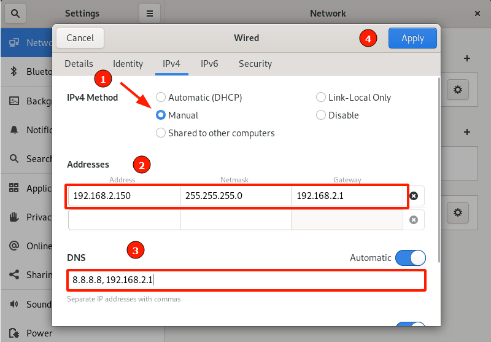
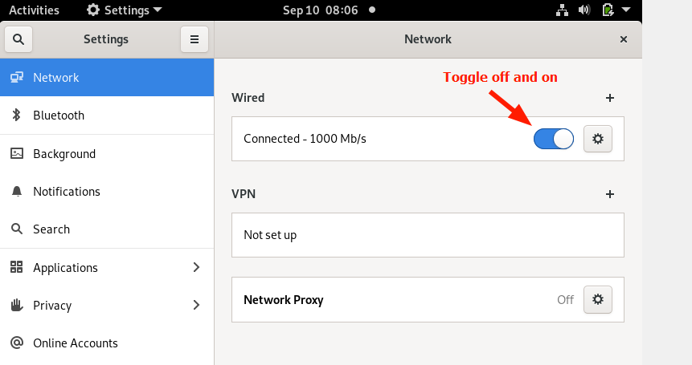
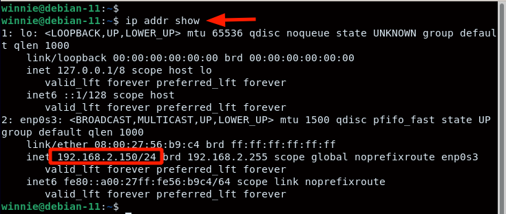
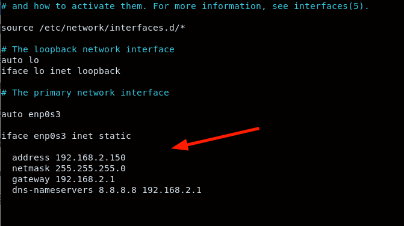
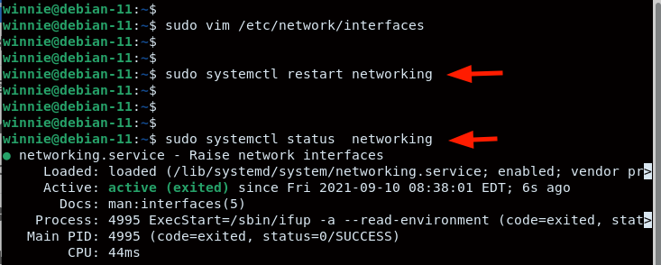

# 怎样在 Debian 11 上设置静态 IP


在 DHCP 网络上，您的 Linux 系统通常会自动从 DHCP 服务器接收 IP 地址，在大多数情况下，它是路由器。 IP 配置通常包括 IPv4 地址、网络掩码、网关和 DNS 设置。 这对于只需要访问 Internet 或网络资源的桌面或客户端 PC 来说通常很方便。

但是，当您要设置服务器时，情况就不同了。 在这种情况下，您需要配置静态 IP 以使服务器始终通过相同的 IP 地址可用。 使用 DHCP，一旦租用时间结束，IP 地址必然会更改，从而导致服务器不可用。

在本指南中，我们将带您逐步了解怎样在 Debian 11 上设置静态 IP。我们将演示怎样在桌面 GUI 和服务器实例上配置静态 IP。


## 先决条件

在您启航时，请确保您已安装并设置了 Debian 11 服务器实例。 此外，请确保您已经配置了一个 sudo 用户。

在 Debian 上有两种配置静态 IP 的方法。 您可以使用 GUI 或命令行来实现这一点。

## 方式一(桌面环境UI)

如果您运行的是 Debian 11 桌面实例，请使用您的用户名和密码登录。 在我们配置静态 IP 之前，首先确认分配给您系统的 IP 地址。 在我们的例子中，我们在 DHCP 网络中有一台 IP 地址为 192.168.2.104 的 Debian PC。

您可以使用显示的命令验证这一点。

```bash
$ ip addr show
```

在我们的系统中， **enp0s3** interface 是分配了 IP 地址的活动链路。 在您的情况下，这可能是另一回事。

要开始设置静态 IP，请单击 **‘活动**‘在左边的远角。 搜索并单击“**设置**‘ 图标。

在“设置”页面上，选择“**网络**‘ 标签。 接下来，转到“有线”部分，然后单击所示的小齿轮。


这将显示当前的 IP 地址配置，如图所示。 正如我们之前所确认的，我们当前的 IP 地址是 192.168.2.104。 这已使用 DHCP 服务动态分配给活动接口。

我们将覆盖 DHCP 设置并手动设置一个静态 IP，该 IP 将在重新启动后持续存在。


点击 **IPv4** 标签。 切换自 ‘**自动的**‘ 到 **‘手动的**‘ 在里面 **IPv4方式** 部分。 此后，指定所需的 IP 地址、网络掩码和默认网关。 请务必同时提供首选 DNS 设置。

要应用所做的更改，请单击**申请** 按钮。




您需要重新启动 Debian 系统的网络守护进程或服务以实现新的静态 IP 设置。 因此，关闭切换按钮，然后再打开。



再次单击齿轮图标以验证是否已应用静态 IP 设置。


在终端上，验证网络接口是否已获取新配置的 IP 地址：

```
$ ip addr show
```

****

输出确认系统已使用静态 IP 成功配置。 现在让我们换档并探索在命令行上设置静态 IP。

## 方式二(服务器环境)

如果您正在运行无外设服务器，或者通过 SSH 连接到远程服务器，则唯一可用的选项是在命令行上配置静态 IP。

网络配置设置存储在 **/etc/网络/接口** 文件。 看一下文件如下。 如果您没有安装 vim，请随意使用 Nano 编辑器。

```bash
$ sudo vim /etc/network/interfaces
```

默认情况下，仅指定环回设置。


我们将为我们的活动网络接口指定 IP 设置。 但在进行任何更改之前，请备份配置文件。

```bash
$ sudo cp /etc/network/interfaces /etc/network/interface.bak
```


按照提供的方式指定 IP 设置。 确保根据您的网络子网进行设置。

```conf
auto enp0s3

iface enp0s3 inet static

 address 192.168.2.150

 netmask 255.255.255.0

 gateway 192.168.2.1

 dns-nameservers 8.8.8.8 192.168.2.1
```



要应用更改，请重新启动网络服务。

```bash
$ sudo systemctl restart networking
```

如果您通过 SSH 连接，这将断开您与服务器的连接。 使用新设置的静态 IP 地址重新连接。



## **结论**

我们概述了两种在 Debian 11 PC 上分配静态 IP 的方法——使用 GUI 和终端。 前者在 Debian 桌面上工作时更容易选择，后者在通过 SSH 客户端配置远程服务器时派上用场。